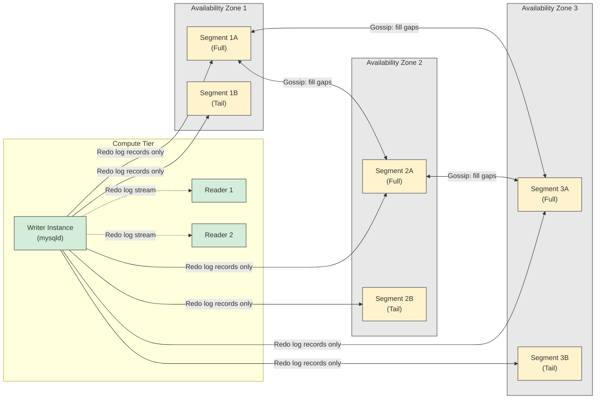

# Chapter 1: Aurora Architecture — Why It's Not MySQL on Better Disks

The most expensive misconception in Aurora migration is also the most natural one: that it behaves like standard InnoDB with faster disks underneath. Aurora is not a storage upgrade. It is a fundamental rearchitecting of the relationship between a database engine and its storage layer, built to solve a specific problem that traditional MySQL cannot solve at cloud scale.

This chapter establishes the architectural foundation everything else builds upon. The compute instances do run a fork of community MySQL with InnoDB, but every assumption about how writes reach disk, how replicas synchronize, and how recovery works has been replaced. Misunderstanding these principles leads to misconfigured clusters, inexplicable lag spikes, and production incidents that standard MySQL debugging instincts cannot resolve.

## 1.1 The Storage-Compute Separation Problem

### 1.1.1 The I/O Amplification Crisis

Traditional MySQL with InnoDB suffers from a write amplification problem that becomes untenable at cloud scale. Consider what happens when a single `UPDATE` modifies one row: InnoDB changes the page containing that row in the buffer pool, writes a redo log record to the write-ahead log, flushes the redo log to disk on commit, eventually writes the dirty page to its final location in the tablespace, and writes the same page again to the doublewrite buffer to protect against torn writes [^1^]. If binary logging is enabled, the change is also written to the binlog. In a mirrored configuration across Availability Zones, each of these writes is replicated — creating what the Aurora SIGMOD paper terms "untenable performance" for cloud workloads [^2^].

The Aurora research team quantified this precisely. In a 30-minute SysBench write-only test, mirrored MySQL sustained 780,000 transactions while performing 7.4 I/Os per transaction [^8^]. The database node writes full data pages, redo logs, doublewrite buffer pages, and binlog events — and that is before the chained replication within EBS and the cross-AZ writes a production deployment requires. The network becomes the bottleneck, not compute or storage [^20^].

This is the problem Aurora was built to solve: not "MySQL is too slow," but "mirrored MySQL generates so many network writes that it saturates the infrastructure before the database engine itself is the bottleneck."

### 1.1.2 The Log-Is-the-Database Paradigm

Aurora inverts the traditional model. The only writes that cross the network from compute to storage are redo log records — never full data pages, not for background writes, not for checkpointing, not for cache eviction [^2^]. The storage fleet receives these redo logs, acknowledges durability, and reconstructs pages asynchronously. As far as the database engine is concerned, the log is the database; any page the storage system materializes is merely a cache of log applications [^17^].

The results are dramatic. In the same 30-minute benchmark, Aurora with replicas sustained 27,378,000 transactions — 35x more than mirrored MySQL — while generating just 0.95 I/Os per transaction on the database node, a 7.7x reduction [^8^]. At the storage tier, each node sees unamplified writes since it is only one of six copies, resulting in 46x fewer I/Os requiring processing [^18^].

The write path follows a simplified sequence: the engine modifies the page in its buffer pool, generates redo log records, batches and shards them by Protection Group, and sends only those log records across the network. Storage nodes apply a quorum protocol, and transaction commits are acknowledged asynchronously [^21^]. Worker threads do not pause for commits; they record the commit LSN and move on [^22^].

### 1.1.3 The 6-Copy Quorum Model: AZ+1 Durability

Aurora replicates data six ways across three Availability Zones — two copies per AZ — to tolerate what AWS calls "AZ+1" failures: the simultaneous loss of an entire Availability Zone plus one additional node [^3^]. The quorum uses six total votes (V=6), a write quorum of 4/6 (V=4), and a read quorum of 3/6 (V=3) [^10^].

This design addresses correlated failures that traditional 2/3 quorums cannot survive. An AZ failure is a correlated failure of every node in that zone — a power event or network partition takes them all down simultaneously [^4^]. With Aurora's 6-copy layout, even if an entire AZ fails plus one additional node, four copies remain, preserving write quorum.

The database volume is partitioned into 10 GB segments called Protection Groups (PGs), each independently replicated 6-way. A 10 GB segment repairs in approximately 10 seconds on a 10 Gbps link [^5^]. Multiple segment failures repair in parallel. Storage volumes auto-grow by adding PGs up to 128 TB [^6^].

The SIGMOD 2018 paper introduced a cost optimization: each Protection Group contains three full segments (redo log plus materialized data blocks) and three tail segments (redo log only). Since data blocks dwarf redo logs in most databases, effective cost amplification is closer to three copies than six [^17^].



**Diagram:** Aurora's storage-compute separation. The writer sends only redo log records to six storage segments across three AZs. Readers receive the redo log stream independently but share the same underlying storage volume. Storage nodes gossip among themselves to fill gaps in the log chain.

## 1.2 The Distributed Storage Fleet

### 1.2.1 Storage Node I/O Pipeline: Foreground vs. Background

Each storage node processes incoming log records through an eight-step pipeline. The critical insight for production debugging is that only steps 1 and 2 are in the foreground latency path; everything else happens asynchronously and does not block commit acknowledgment [^10^].

| Step | Phase | Path | Description |
|------|-------|------|-------------|
| 1 | Receive | **Foreground** | Receive log record and add to in-memory queue |
| 2 | Persist | **Foreground** | Persist record on disk and acknowledge to database |
| 3 | Organize | Background | Organize records and identify gaps in the log |
| 4 | Gossip | Background | Exchange missing records with peer storage nodes |
| 5 | Coalesce | Background | Merge log records into new data page versions |
| 6 | Stage to S3 | Background | Periodically stage log and pages to S3 for backup |
| 7 | Garbage Collect | Background | Remove old page versions based on PGMRPL low-water mark |
| 8 | Validate CRC | Background | Verify data integrity of stored pages |

The foreground-background separation is a core design tenet: storage service minimizes write latency by moving the majority of processing to the background. Critically, background processing has *negative* correlation with foreground — when foreground load is high, background work backs off. This is the opposite of traditional databases, where checkpointing has *positive* correlation with foreground load, creating I/O spikes and jitter [^14^].

Storage nodes use peer-to-peer gossip to fill gaps. Each log record contains a backlink to the previous record for its Protection Group, enabling nodes to track their Segment Complete LSN (SCL) — the greatest LSN below which all log records for that PG have been received [^18^]. If Segment 1 is missing LSN 4, it gossips with Segment 2 to retrieve it and advances its SCL [^19^].

### 1.2.2 Consistency Points: VCL, VDL, SCL, and CPL

Aurora avoids distributed consensus protocols by using monotonically increasing Log Sequence Numbers and a hierarchy of consistency points [^12^]. Understanding these acronyms is essential for diagnosing replication anomalies.

**LSN** (Log Sequence Number) is a monotonically increasing value assigned to each log record. **CPL** (Consistency Point LSN) marks the final log record of a mini-transaction — operations that must execute atomically, such as a B+ tree page split [^7^]. **SCL** (Segment Complete LSN) tracks the greatest LSN below which all log records of a given PG have been received by a storage segment. **VCL** (Volume Complete LSN) is the highest LSN for which all prior log records have met write quorum across all Protection Groups. **VDL** (Volume Durable LSN) is the highest CPL ≤ VCL — the actual durability point for commits [^13^].

The VCL/VDL distinction matters operationally. If storage has received records up to LSN 1007 but only LSNs 900, 1000, and 1100 are CPLs, the system is "complete" to 1007 but only "durable" to 1000. Recovery truncates records above VDL [^40^].

Transaction commits use VDL as their durability gate. A worker thread records the commit LSN and moves on; a dedicated commit thread scans the queue and acknowledges clients whose commit LSN ≤ current VDL [^21^]. This eliminates worker thread blocking — no induced latency from group commits and no idle time [^22^].

```sql
-- Check VDL and related LSN progress on the writer
-- (Available via SHOW ENGINE INNODB STATUS; look for Log sequence number)
SHOW ENGINE INNODB STATUS\G
-- Key lines to monitor:
-- Log sequence number          - Current LSN being generated
-- Log flushed up to            - LSN durably written to storage
-- Pages flushed up to          - Page materialization progress (less relevant in Aurora)
-- Last checkpoint at           - Aurora manages this at storage layer

-- Monitor the History List Length (cluster-wide undo growth)
SELECT NAME AS RollbackSegmentHistoryListLength, COUNT
FROM INFORMATION_SCHEMA.INNODB_METRICS
WHERE NAME = 'trx_rseg_history_len';
-- Thresholds: <1,000 healthy; 1,000-10,000 purge falling behind;
-- >100,000 significant query slowdown; millions = danger zone
```

## 1.3 What Aurora Eliminates (And What It Keeps)

### 1.3.1 Eliminated: Doublewrite Buffer, Traditional Checkpointing, Full-Page Network Writes

Aurora's log-structured storage eliminates the need for InnoDB's doublewrite buffer — a known source of contention in standard MySQL [^16^]. Since only redo log records (not full pages) are sent to storage, and each record is atomically persisted in 4 KB units, torn page writes cannot occur [^15^]. The parameter `innodb_doublewrite` is not exposed for tuning.

Traditional checkpointing is also eliminated. In standard MySQL, periodic checkpointing writes dirty pages to bound recovery time, causing I/O spikes when the redo log fills. Aurora offloads this to the storage fleet, which continuously materializes pages in the background [^16^]. Materialization is correctness-optional: as far as the engine is concerned, the log is the database [^17^].

Crash recovery is transformed. Traditional databases replay redo logs from the last checkpoint — often single-threaded, taking minutes. Aurora performs recovery asynchronously on parallel threads at the storage tier; the database is available immediately after a crash [^28^]. AWS benchmarks show Aurora recovers up to 97% faster because storage replays log records continuously [^27^].

### 1.3.2 Kept: InnoDB's Core Engine

What Aurora preserves is equally important. The compute instances run InnoDB's B+ tree indexes, MVCC with undo logs, row-level locking via next-key locks, and all standard transaction isolation levels. Query parsing, optimization, and execution follow the MySQL code path. `EXPLAIN`, `SHOW ENGINE INNODB STATUS`, `INFORMATION_SCHEMA` queries, and lock monitoring all work as expected. The architectural changes are almost entirely below the storage engine API.

This has a critical implication: many production problems in Aurora are standard InnoDB problems. Lock waits, deadlocks, slow queries from missing indexes, and MVCC version chain traversal follow MySQL semantics. Aurora is best understood as InnoDB with modified storage plumbing — debugging techniques remain applicable, but symptoms may differ because of shared storage.

### 1.3.3 Aurora-Specific Additions: Survivable Cache, csdd, and Health Monitor

Aurora introduces three components with no standard MySQL equivalent. The **survivable page cache** manages each instance's buffer pool in a separate process, allowing it to survive database restarts without repopulation [^23^][^57^]. Aurora MySQL 2.10+ also keeps in-region readers from rebooting on writer restart [^35^]. However — critical for failover planning — the survivable cache is instance-local. A reader promoted to writer starts with *its* buffer pool, not the original writer's. Cluster Cache Management, which pre-warms failover targets, is Aurora PostgreSQL only [^334^].

The **cluster storage daemon (csdd)** manages communication between compute and storage. The **health monitor (HM)** tracks instance health for the Aurora control plane. Together with `mysqld`, these three processes consume memory on every Aurora instance [^101^]. RDS MySQL has only `mysqld` and HM. Aurora's extra process overhead and absence of swap space make OOM kills more likely than in RDS MySQL [^101^].

```sql
-- Check memory usage by background threads:
SELECT NAME, SUM(CURRENT_NUMBER_OF_BYTES_USED) / 1024 / 1024 AS mb_used
FROM performance_schema.memory_summary_by_thread_by_event_name
WHERE NAME LIKE '%background%'
GROUP BY NAME
ORDER BY mb_used DESC;

-- Monitor freeable memory (critical for OOM prevention)
-- CloudWatch metric: FreeableMemory
-- Alert threshold: FreeableMemory < 10% of instance RAM
```

| Component | Standard MySQL | Aurora MySQL | Operational Impact |
|-----------|---------------|--------------|-------------------|
| Network writes | Full data pages + redo log + doublewrite + binlog | Redo log records only | 7.7x fewer I/Os per transaction [^8^] |
| Durability | Local `fsync` or semi-sync replication | 4/6 quorum across 3 AZs | Survives AZ+1 failure without data loss |
| Checkpointing | Engine-driven, periodic I/O spikes | Continuous, storage-driven | No checkpoint-related jitter or stalls [^14^] |
| Doublewrite buffer | Required; ~2x page write amplification | Eliminated | Reduced contention, simpler tuning [^16^] |
| Crash recovery | Replay from last checkpoint (minutes) | Near-instant; parallel at storage tier | 97% faster recovery; no startup replay [^27^] |
| Buffer pool on restart | Lost; cold start | Survives process restart [^23^] | Faster recovery; but failover target may still be cold |
| Read replicas | Binlog shipping; independent storage | Shared storage; redo log cache invalidation | <20ms typical lag; up to 15 replicas [^29^] |
| Storage scaling | Manual, with downtime | Automatic up to 128 TB | Zero-downtime growth |
| Write amplification | ~7.4 I/Os per transaction | ~0.95 I/Os per transaction | 35x more throughput in benchmarks [^8^] |
| Background I/O correlation | Positive (spikes under load) | Negative (backs off under load) | More predictable latency under stress [^14^] |

This table captures the architectural differences that directly affect operational decisions. The write amplification reduction is not a marginal improvement — it is structural, enabling workloads that would saturate network bandwidth on standard MySQL to run comfortably on Aurora. The elimination of checkpointing and doublewrite buffer removes two of the most common sources of production performance variance in InnoDB deployments. However, the shared storage model introduces new failure modes that standard MySQL does not exhibit — these are covered in Chapters 3 through 6.

## 1.4 Read Replicas: Shared Storage, Independent Caches

### 1.4.1 All Replicas Read from the Same Storage Volume

Aurora's most visible operational difference is its read replica architecture. A single writer and up to 15 read replicas mount the same shared storage volume [^29^]. Replicas add no storage cost and perform no storage writes — they receive the same redo log stream the writer sends to storage nodes, applying it only to pages in their local buffer cache [^32^]. Records for pages not in cache are discarded [^29^].

This eliminates binlog shipping for intra-cluster replication. The storage layer is strongly consistent: once a transaction reaches write quorum, its changes are immediately visible to any instance reading from storage. The buffer pool layer, however, is eventually consistent — a reader with a cached page may serve stale data until the redo log is applied [^11^].

### 1.4.2 Each Replica Maintains Its Own Buffer Pool

Every reader maintains an independent buffer pool, populated via redo log application. New readers start cold and warm up by reading pages from shared storage as queries demand them. Each reader builds its working set independently based on its query patterns.

Readers apply only log records with LSN ≤ current VDL, and apply mini-transactions atomically to maintain structural consistency of B-tree pages [^29^].

The Adaptive Hash Index is silently disabled on Aurora reader nodes — AWS engineers have confirmed it cannot be enabled despite parameter group appearances [^40^]. Queries relying on AHI run approximately 2x slower on readers. The mitigation is covering indexes that eliminate secondary key lookups.

### 1.4.3 AuroraReplicaLag: Cache Update Delay, Not Transaction Delay

The `AuroraReplicaLag` CloudWatch metric measures the delay for a reader's buffer pool to be updated — it does NOT measure storage-level replication lag [^351^]. Storage is strongly consistent; there is essentially zero storage lag. The metric reflects only the time between when a change is committed to storage and when the reader has applied the corresponding redo log to its cached pages. In practice, replica lag is typically under 20ms and often under 10ms [^29^].

This distinction causes production confusion. An application that writes to the cluster endpoint and immediately reads from a reader may see stale data even when `AuroraReplicaLag` is near-zero, because the metric does not capture whether the specific page has had its redo log applied [^168^]. For read-after-write consistency, query the writer.

Lag spikes have several root causes: under-provisioned readers lacking CPU for redo application; heavy analytical queries consuming reader resources; bulk writes overwhelming redo consumption; and most critically, a long-running transaction completing and triggering a massive purge that generates additional redo, causing readers to fall behind and restart in a cascade [^317^].

```sql
-- Identify reader instances holding old read views (blocks cluster-wide purge)
SELECT SERVER_ID,
       IF(SESSION_ID = 'master_session_id', 'writer', 'reader') AS ROLE,
       REPLICA_LAG_IN_MSEC, OLDEST_READ_VIEW_TRX_ID, OLDEST_READ_VIEW_LSN
FROM MYSQL.RO_REPLICA_STATUS ORDER BY OLDEST_READ_VIEW_TRX_ID;

-- Find long-running transactions on any instance
SELECT a.TRX_ID, a.TRX_STARTED,
       TIMESTAMPDIFF(SECOND, a.TRX_STARTED, NOW()) AS SECONDS_OPEN,
       b.USER, b.HOST, b.STATE
FROM INFORMATION_SCHEMA.INNODB_TRX a
JOIN INFORMATION_SCHEMA.PROCESSLIST b ON a.TRX_MYSQL_THREAD_ID = b.ID
WHERE TIMESTAMPDIFF(SECOND, a.TRX_STARTED, NOW()) > 60 ORDER BY a.TRX_STARTED;
```

```bash
# Check replica lag across all readers via CloudWatch
aws cloudwatch get-metric-statistics \
  --namespace AWS/RDS --metric-name AuroraReplicaLag \
  --dimensions Name=DBClusterIdentifier,Value=my-cluster Name=Role,Value=READER \
  --start-time $(date -u -d '1 hour ago' +%Y-%m-%dT%H:%M:%S) \
  --end-time $(date -u +%Y-%m-%dT%H:%M:%S) --period 60 \
  --statistics Average Maximum
# Alert thresholds: >100ms warning, >1,000ms critical, >5,000ms reader restarting
```

When a reader falls too far behind, the control plane automatically restarts it [^157^]. All connections drop, the buffer pool clears, and the reader begins fresh. This is by design — Aurora prefers brief unavailability to serving stale data.

The shared undo log architecture creates critical coupling between readers and the writer. A long-running `SELECT` on a reader opens a read view that blocks the writer's purge thread cluster-wide. History List Length grows unbounded, queries slow as version chain traversal becomes expensive, and the cluster enters a degradation spiral broken only by terminating the offending query [^15^][^16^]. Chapter 5 covers purge mechanics in detail; the operational takeaway is that workload isolation via custom endpoints is not merely a performance optimization — it is an availability requirement.

---

Now that we understand the storage layer, let's look at how InnoDB organizes data within it. Chapter 2 examines the page structure, B+ tree indexes, and row format that sit on top of Aurora's distributed storage.
