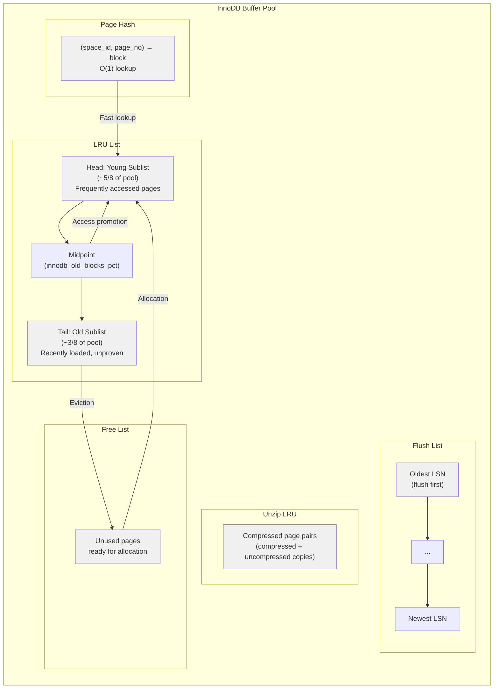

# Chapter 3: The InnoDB Buffer Pool — Aurora's Most Critical Resource

Chapter 2 showed us the physical layout of rows inside 16KB pages — the File Header, the Page Directory, the record heap, and the 13 bytes of hidden system columns that anchor every version chain. The buffer pool is where those pages reside in memory, and it is the most critical resource in any Aurora instance. It occupies 75% of available RAM by default [^66^]. Every other subsystem — connection threads, sort buffers, the cluster storage daemon — operates within the remaining quarter. A misconfigured or undersized buffer pool is the root cause of the majority of Aurora performance incidents.

This chapter examines the buffer pool's internal structures, the critical differences between Aurora writer and reader instances, sizing guidelines for Aurora's three-process memory model, and production monitoring queries.

## 3.1 Buffer Pool Architecture

The InnoDB buffer pool is a fixed-size memory region that caches data pages, index pages, undo log pages, and auxiliary structures to minimize reads from the distributed storage layer [^98^]. Despite Aurora's radical storage architecture, the buffer pool itself remains fundamentally InnoDB-compatible. The key structures are the LRU list, the flush list, the free list, the unzip LRU, and the page hash.

### 3.1.1 LRU List with Midpoint Insertion

The buffer pool uses an LRU algorithm with a **midpoint insertion strategy** that divides the list into two sublists [^54^]:

- **Young (hot) sublist**: Pages at the head, recently and frequently accessed. By default, 5/8 of the buffer pool.
- **Old (cold) sublist**: Pages from the midpoint to the tail, not yet proven valuable. By default, 3/8 [^54^].

When InnoDB reads a page into the buffer pool, it inserts it at the midpoint — the head of the old sublist [^54^]. A page loaded by a full table scan that is never revisited ages out from the tail of the old list without displacing hot pages. Only when a page in the old sublist receives a subsequent access does it migrate to the head of the young sublist.

Two parameters control this behavior. `innodb_old_blocks_pct` (default 37) sets the old sublist percentage [^70^]. Lower it to protect the young sublist from scan-heavy workloads; raise it for large, varied working sets. `innodb_old_blocks_time` (default 1000 ms) is the delay before an old-list page can be promoted on access [^70^]. Increasing it to 2000–3000 ms on OLTP workloads with frequent reporting scans reduces cache pollution.

```sql
-- Check LRU tuning parameters; increase old_blocks_time if scans pollute cache
SHOW VARIABLES LIKE 'innodb_old_blocks%';
```

The midpoint insertion strategy is the primary defense against cache thrashing. Without it, a single `SELECT *` on a 50 GB table could evict an entire OLTP working set from a 64 GB buffer pool.

### 3.1.2 Flush List

The flush list is an ordered list of **dirty pages** — pages modified in memory but not yet persisted — sorted by the LSN at which they were first dirtied [^53^]. Page cleaner threads traverse this list in LSN order, flushing oldest first to advance the checkpoint.

In standard MySQL, flush list pressure causes write stalls when dirty pages accumulate faster than they can be flushed. In Aurora, the storage layer continuously materializes pages in the background, so this pressure is largely eliminated [^14^]. However, the flush list still exists and background flushing threads continue to operate. Set `innodb_flush_neighbors = 0` for Aurora because distributed storage does not benefit from flushing contiguous pages [^46^].

### 3.1.3 Free List, Unzip LRU, and Page Hash

The **free list** contains pages ready for allocation. When no free pages exist, InnoDB evicts from the tail of the old LRU sublist [^45^]. If eviction cannot keep pace with demand, queries block waiting for free pages — visible in `Innodb_buffer_pool_wait_free`.

The **unzip LRU** handles compressed tables (`ROW_FORMAT=COMPRESSED`), tracking compressed and uncompressed page pairs. When space is needed, InnoDB can evict the uncompressed copy while retaining the compressed version [^54^].

The **page hash** provides O(1) lookup from `(space_id, page_number)` to the buffer block. It is sized dynamically and not user-configurable.

The following diagram illustrates the buffer pool's internal structure:



The following table summarizes the operations that move pages between these structures:

| Operation | Source | Destination | Trigger |
|-----------|--------|-------------|---------|
| Page load (cache miss) | Storage | Old sublist (midpoint) | Page requested by query or read-ahead |
| Page promotion | Old sublist | Young sublist head | Access after `innodb_old_blocks_time` delay [^54^] |
| Page aging | Young sublist head | Toward tail | Newer pages promoted to head |
| Page eviction | Tail of old sublist | Free list | Buffer pool full, page not accessed |
| Dirty page creation | Clean page | Flush list | DML modifies page contents |
| Dirty page flush | Flush list | Clean page (removed) | Page cleaner thread writes to storage [^53^] |
| Free page allocation | Free list | Old sublist | New page load requires buffer frame |
| Compression eviction | Unzip LRU | Compressed only | Memory pressure, uncompressed copy freed [^54^] |

These transitions are essential for interpreting `SHOW ENGINE INNODB STATUS`. A high "pages made young" rate indicates a working set that fits in the young sublist. Dominant "not young" counts mean scans are evicting pages before promotion.

## 3.2 Buffer Pool on Aurora Writer vs Reader

Aurora's key architectural departure is that **all instances share the same distributed storage volume**, yet each maintains its own independent buffer pool [^3^][^27^]. This enables up to 15 read replicas without storage duplication, but creates critical behavior differences between writers and readers.

### 3.2.1 Writer Buffer Pool

The writer instance's buffer pool functions as the primary cache for the cluster. It contains both clean and dirty pages, serves all write operations, and is the source of the redo log stream that feeds both the storage layer and all readers [^29^].

Three Aurora-specific constraints apply to the writer:

**Dirty page management.** The writer maintains both clean and dirty pages in its LRU list. Dirty pages — pages modified by writes that have not yet been flushed — live on both the LRU list (for access ordering) and the flush list (for write ordering by LSN). Page cleaner threads walk the flush list asynchronously, writing oldest-first. In Aurora, this flushing is largely a formality since the storage layer continuously materializes pages from redo logs, but the flush list mechanics remain intact and visible in `SHOW ENGINE INNODB STATUS` [^53^].

**Change buffer disabled.** `innodb_change_buffering` is `none` and cannot be modified [^93^]. The change buffer, which in standard MySQL caches secondary index modifications when the target page is not cached, is incompatible with shared storage because changes must be immediately visible to all instances.

**Query cache removed in Aurora 3.x.** Aurora MySQL 3.x (MySQL 8.0 compatible) removed the query cache entirely [^42^][^58^]. Applications that relied on it in 2.x will see increased latency after upgrade.

**Adaptive hash index available.** AHI can be enabled on the writer, building an in-memory hash table atop frequently accessed B-tree pages to accelerate exact-match lookups [^40^]. It consumes buffer pool memory, so monitor its footprint on write-heavy workloads.

### 3.2.2 Reader Buffer Pool

Reader buffer pools are structurally identical to the writer's but behave differently. Each reader starts with a cold cache and must warm up by reading from storage [^3^].

**Redo log application to cached pages.** Readers receive the writer's redo log stream. For each log record, if the referenced page is in the reader's cache, the redo is applied directly [^29^]; otherwise the record is discarded [^29^]. This keeps hot pages current without storage re-reads. Readers apply only log records with LSN <= the Volume Durable LSN (VDL), and apply mini-transactions atomically to maintain B-tree consistency [^29^]. Healthy replica lag is typically under 20 ms.

**No dirty pages on readers.** Readers do not persist pages or redo logs to storage [^15^]. All writes are handled by the writer. Reader buffer pools contain only clean pages.

**Adaptive hash index disabled.** AHI **cannot be enabled on Aurora readers**, even though the parameter group allows changing it [^40^]. AWS engineers confirmed this. Queries dependent on secondary key lookups may be up to 2x slower on readers [^40^]. Workarounds: run AHI-dependent queries on the writer, add covering indexes, or use RDS MySQL where AHI works on replicas.

The following table summarizes the critical differences:

| Aspect | Aurora Writer | Aurora Reader |
|--------|--------------|---------------|
| Dirty pages | Yes (standard dirty page management) | No (readers do not write to storage) [^15^] |
| Change buffer | Disabled (`none`, not configurable) [^93^] | N/A (no writes) |
| Adaptive hash index | Available, configurable [^40^] | **Silently disabled** regardless of parameter [^40^] |
| Query cache (3.x) | Removed [^58^] | Removed [^58^] |
| Redo log application | Generates and sends redo logs | Applies redo to cached pages only [^29^] |
| Page reads | From storage on cache miss | From storage on cache miss |
| Initial state | Survives process restart [^12^] | Cold on first attachment [^3^] |
| Storage writes | Full write responsibility | None (read-only from shared volume) [^15^] |
| Undo log access | Shares undo with all instances | Shares undo with all instances [^15^] |

Benchmark critical secondary-key queries on both writer and reader during load testing to quantify the AHI impact for your specific schema.

### 3.2.3 Survivable Page Cache

A unique Aurora feature is the **survivable page cache** (warm cache). The buffer pool is managed in a separate process from the database engine, allowing it to survive database process restarts independently [^12^][^57^]. This eliminates the post-restart performance cliff that standard MySQL experiences.

However, **the survivable page cache is instance-local** — it survives restarts of the same instance but does NOT survive a failover promotion [^23^]. When a reader is promoted to writer, it starts with only its own cached pages; hot pages from the original writer that were absent on the promoted reader must be read from storage. Planned restarts are fast, but unplanned failovers start with a partially cold cache. Cluster Cache Management (which pre-warms failover targets) is Aurora PostgreSQL-only, not MySQL [^334^].

Post-failover performance degradation of 30–50% for 10–30 minutes should be expected. After any failover, run a cache-warming script that executes representative queries against your hottest tables before cutting over full traffic.

## 3.3 Sizing and Tuning

Buffer pool sizing is the most consequential tuning decision in Aurora because it is one of the few user-controllable parameters with disproportionate impact. Aurora automates I/O capacity, log file size, and flush method, leaving buffer pool size as the dominant performance lever.

### 3.3.1 Default Sizing: 75% of RAM

Aurora preconfigures `innodb_buffer_pool_size` to 75% of `DBInstanceClassMemory` [^66^][^105^]:

```
innodb_buffer_pool_size = DBInstanceClassMemory * 3/4
```

This default fits most OLTP workloads. Increasing it risks OOM kills — Aurora has no swap, so an oversized pool leaves insufficient memory for connection threads, sort buffers, and Aurora's own processes [^101^]. Decreasing it causes I/O amplification, raising both latency and I/O costs. Before deviating from 75%, confirm your workload benefits and account for all memory consumers.

When evaluating whether to increase the buffer pool, consider what currently drives cache misses. If `BufferCacheHitRatio` is already above 99% and the working set is fully cached, adding memory yields no benefit. If the ratio is 85% and `ReadIOPS` is elevated, a larger pool may help — but so may query optimization, better indexing, or isolating analytical scans to dedicated reader instances. Memory is the most expensive resource to scale; exhaust cheaper options first.

### 3.3.2 Buffer Pool Instances

For buffer pools larger than 1 GB, multiple instances reduce contention. Each page is assigned to one instance via hash, and each instance maintains independent free lists, flush lists, and LRUs [^62^][^69^]. Page cleaner threads default to match instance count [^46^]. Recommended sizing:

| Buffer Pool Size | Recommended Instances | Rationale |
|-----------------|----------------------|-----------|
| < 1 GB | 1 | Below the multi-instance threshold [^62^] |
| 1–8 GB | 2–4 | Modest concurrency, avoid excessive splitting |
| 8–64 GB | 4–8 | Production OLTP sweet spot |
| 64 GB+ | 8–16 | High-concurrency workloads, up to max 64 [^62^] |

Each instance should be at least 1 GB for efficient operation [^62^][^69^]. On smaller Aurora instances (db.r6g.large with 16 GB RAM, yielding ~12 GB buffer pool at 75%), setting 8 instances would yield only ~1.5 GB each — acceptable, but 4 instances at ~3 GB each is often better for workloads with a concentrated hot set. The goal is to minimize cross-thread contention without fragmenting the working set so finely that each instance's hot set becomes too small.

### 3.3.3 Aurora Memory Overhead

Aurora runs three memory-consuming processes versus two in RDS MySQL [^101^]:

- **mysqld**: The database engine, including the buffer pool
- **csdd**: Cluster storage daemon, communicating with distributed storage
- **HM**: Health monitor

RDS MySQL lacks `csdd` because it writes to local EBS. This additional overhead, combined with no swap [^101^], makes OOM kills more likely than in RDS MySQL.

`DBInstanceClassMemory` is not total physical RAM — AWS subtracts OS and hypervisor reservations. A db.r5.8xlarge advertises 256 GB but Enhanced Monitoring shows ~249 GB [^101^]. If OOM kills occur, reduce `innodb_buffer_pool_size` to 1/2 of instance memory or scale up [^101^][^103^].

Buffer pool resizing in Aurora MySQL 3.x is online. The resize proceeds in chunks of `innodb_buffer_pool_chunk_size` (default 128 MB) [^108^]. Size must be a multiple of `chunk_size * instances` [^52^][^108^].

## 3.4 Monitoring and Debugging

### 3.4.1 Key Metrics and Thresholds

The following table lists the metrics every Aurora DBA should monitor, with healthy thresholds and alert conditions:

| Metric | Source | Healthy Threshold | Alert Condition | Interpretation |
|--------|--------|------------------|-----------------|----------------|
| `BufferCacheHitRatio` | CloudWatch | > 95% [^44^] | < 90% sustained | Percentage of reads served from buffer cache vs storage [^59^] |
| `Innodb_buffer_pool_reads` / `Innodb_buffer_pool_read_requests` | `SHOW STATUS` | Ratio < 1% | Ratio > 5% | Cache miss rate; high values indicate working set exceeds pool [^86^] |
| `Innodb_buffer_pool_wait_free` | `SHOW STATUS` | 0 | > 0 per minute | Queries blocked waiting for free pages; signals severe pressure [^86^] |
| `Innodb_buffer_pool_pages_free` | `SHOW STATUS` | > 5% of total | < 1% of total | Near-zero free pages trigger aggressive LRU flushing |
| `FreeableMemory` | CloudWatch | Stable or slow decline | Rapid decline | Available RAM; declining trend signals OOM risk |
| `AuroraReplicaLag` | CloudWatch | < 20 ms [^29^] | > 100 ms sustained | Reader buffer pool cache update lag (not transaction lag) [^351^] |
| `Pages read ahead evicted` | `SHOW ENGINE INNODB STATUS` | Near zero | > 10% of read ahead | Read-ahead loading pages never accessed; wastes cache space [^70^] |
| `youngs/s` / `non-youngs/s` | `SHOW ENGINE INNODB STATUS` | youngs > non-youngs | non-youngs >> youngs | Cache pollution from scans exceeding promotion threshold |

`BufferCacheHitRatio` is the single most important day-to-day indicator. AWS recommends keeping it as high as possible [^59^]; sustained values below 90% signal working set exceeding capacity [^44^]. Correlate with `ReadIOPS` spikes and `AuroraReplicaLag` to distinguish stable undersizing from active thrashing.

```sql
-- Buffer pool hit rate percentage; target > 95%
SELECT
    ROUND(
        (1 - (
            (SELECT VARIABLE_VALUE FROM performance_schema.global_status
             WHERE VARIABLE_NAME = 'Innodb_buffer_pool_reads') /
            NULLIF((SELECT VARIABLE_VALUE FROM performance_schema.global_status
             WHERE VARIABLE_NAME = 'Innodb_buffer_pool_read_requests'), 0)
        )) * 100, 2
    ) AS buffer_pool_hit_rate_pct;
```

### 3.4.2 SHOW ENGINE INNODB STATUS: BUFFER POOL AND MEMORY

The `SHOW ENGINE INNODB STATUS` command provides the most comprehensive view of buffer pool state. The `BUFFER POOL AND MEMORY` section contains the following critical fields:

```
----------------------
BUFFER POOL AND MEMORY
----------------------
Total large memory allocated 137428992
Dictionary memory allocated 538050
Buffer pool size   8192
Free buffers       1024
Database pages     7167
Old database pages 2644
Modified db pages  12
Pending reads 0
Pending writes: LRU 0, flush list 0, single page 0
Pages made young 14823, not young 0
0.00 youngs/s, 0.00 non-youngs/s
Pages read 6145, created 1022, written 2845
0.00 reads/s, 0.00 creates/s, 0.00 writes/s
Buffer pool hit rate 997 / 1000, young-making rate 0 / 1000 not 0 / 1000
Pages read ahead 0.00/s, evicted without access 0.00/s, Random read ahead 0.00/s
LRU len: 7167, unzip_LRU len: 0
I/O sum[0]:cur[0], unzip sum[0]:cur[0]
```

Key fields to interpret [^52^][^86^]:

- **Buffer pool size**: Total pages (multiply by 16 KB for bytes). Should match configured size.
- **Free buffers**: Available pages. Should remain > 5% of total; near-zero indicates severe pressure.
- **Old database pages**: Should approximate 37% of total (default `innodb_old_blocks_pct`). Higher values suggest the young sublist is squeezed.
- **Modified db pages**: Dirty pages. In Aurora this stays low as the storage layer handles persistence [^93^].
- **Buffer pool hit rate**: Expressed as `N / 1000`. 997/1000 = 99.7% cache hits [^52^]. Below 990/1000 suggests undersizing.
- **Pages made young / not young**: When `non-youngs/s` exceeds `youngs/s`, scans are preventing the working set from establishing in the young sublist.
- **Pages read ahead / evicted without access**: High eviction means prefetch loads unused pages [^70^]. Lower `innodb_read_ahead_threshold` (default 56) or disable random read-ahead.

Per-instance statistics via Information Schema:

```sql
-- Per-buffer-pool-instance statistics
SELECT
    POOL_ID,
    POOL_SIZE * 16 / 1024 AS pool_size_mb,
    DATABASE_PAGES,
    FREE_BUFFERS,
    OLD_DATABASE_PAGES,
    MODIFIED_DATABASE_PAGES AS dirty_pages,
    ROUND(HIT_RATE / 1000.0 * 100, 2) AS hit_rate_pct,
    NUMBER_PAGES_READ_AHEAD,
    NUMBER_READ_AHEAD_EVICTED
FROM information_schema.INNODB_BUFFER_POOL_STATS
ORDER BY POOL_ID;
```

Avoid querying `INNODB_BUFFER_PAGE` or `INNODB_BUFFER_PAGE_LRU` on production unless necessary — these tables hold information about every individual page and can introduce significant performance overhead [^92^]. Use `INNODB_BUFFER_POOL_STATS` for aggregate visibility instead.

### 3.4.3 Common Production Issues

**Cache thrashing.** When the working set exceeds buffer pool capacity, pages are constantly evicted and reloaded. Symptoms: `BufferCacheHitRatio` < 90%, elevated `ReadIOPS`, increasing `AuroraReplicaLag` [^2^], and non-zero `Innodb_buffer_pool_wait_free`. Resolution: scale up, add indexes, or isolate scans to dedicated readers via custom endpoints.

**Cold cache after restart or failover.** The survivable page cache is lost during cluster or instance reboots [^59^]. Pages must then be read from the cluster volume, increasing latency and I/O billing. Use buffer pool dump/restore for planned restarts [^91^]; run a cache-warming script after unplanned failovers.

An effective cache-warming script selects representative rows from each hot table to pull their pages into the buffer pool without heavy resource consumption:

```sql
-- Cache-warming script: run immediately after failover
SELECT * FROM hot_table_1 WHERE pk IN (1, 1000, 5000, 10000);
SELECT * FROM hot_table_2 WHERE pk IN (500, 2000, 8000);
-- Add your application's most-accessed tables and key ranges
```

Run this script before routing application traffic to the newly promoted writer. The 30–50% performance degradation window shortens proportionally to how many hot pages the warming script touches.

**OOM kills from oversized buffer pools.** Aurora has no swap [^101^]. When memory is exhausted, the OOM killer terminates mysqld. Three processes (mysqld, csdd, HM) compete for memory, making OOM more likely than in RDS MySQL [^101^]. If `FreeableMemory` drops to near-zero before unexplained restarts, reduce `innodb_buffer_pool_size` or scale up.

**Buffer pool pressure causing replica lag.** When a reader's buffer pool is full and must evict pages to apply redo, lag increases [^2^] — a compounding effect where more lag creates more pressure. Monitor `AuroraReplicaLag` with `BufferCacheHitRatio` and `FreeableMemory` on readers. If all three degrade, the reader is under-provisioned. AWS recommends all instances have the same specification [^6^].

```sql
-- Diagnose buffer pool pressure on a reader
SELECT
    (SELECT VARIABLE_VALUE FROM performance_schema.global_status
     WHERE VARIABLE_NAME = 'Innodb_buffer_pool_reads') AS disk_reads,
    (SELECT VARIABLE_VALUE FROM performance_schema.global_status
     WHERE VARIABLE_NAME = 'Innodb_buffer_pool_read_requests') AS logical_reads,
    (SELECT VARIABLE_VALUE FROM performance_schema.global_status
     WHERE VARIABLE_NAME = 'Innodb_buffer_pool_wait_free') AS wait_free,
    (SELECT VARIABLE_VALUE FROM performance_schema.global_status
     WHERE VARIABLE_NAME = 'Innodb_buffer_pool_pages_free') AS free_pages,
    (SELECT VARIABLE_VALUE FROM performance_schema.global_status
     WHERE VARIABLE_NAME = 'Innodb_buffer_pool_pages_total') AS total_pages;
```

The buffer pool is Aurora's most critical resource because it is simultaneously the primary performance accelerator, the largest memory consumer, and the mechanism through which readers maintain consistency with the writer. A well-monitored buffer pool keeps read latency in microseconds and replica lag in milliseconds; a neglected one produces cascading failures — cache misses drive I/O costs, replica lag extends failover time, and OOM kills cause downtime. The monitoring queries and thresholds in this section belong in every Aurora operator's runbook.

---

The buffer pool caches pages. But what happens when a transaction changes data on a page? Chapter 4 introduces MVCC — the mechanism that makes readers and writers coexist without blocking each other.


## References

[^2^]: [AWS Documentation, "Amazon Aurora Storage Overview."](https://docs.aws.amazon.com/AmazonRDS/latest/AuroraUserGuide/Aurora.Storage.html)
[^3^]: [AWS Documentation, "Amazon Aurora: How It Works — Storage."](https://docs.aws.amazon.com/AmazonRDS/latest/AuroraUserGuide/CHAP_Aurora.html)
[^6^]: [AWS Documentation, "Monitoring Aurora Replication with Amazon CloudWatch."](https://docs.aws.amazon.com/AmazonRDS/latest/AuroraUserGuide/Aurora.Replication.Monitoring.html)
[^15^]: [AWS Documentation, "Doublewrite Buffer Elimination in Aurora."](https://docs.aws.amazon.com/AmazonRDS/latest/AuroraUserGuide/AuroraMySQL.Managing.Performance.html)
[^23^]: [AWS Documentation, "innodb_flush_log_at_trx_commit in Aurora."](https://docs.aws.amazon.com/AmazonRDS/latest/AuroraUserGuide/AuroraMySQL.Reference.Parameters.html)
[^27^]: [AWS Documentation, "Aurora Crash Recovery — 97% Faster."](https://docs.aws.amazon.com/AmazonRDS/latest/AuroraUserGuide/Aurora.Overview.Storage.html)
[^29^]: [AWS Documentation, "VDL Truncation and Epoch Fencing."](https://docs.aws.amazon.com/AmazonRDS/latest/AuroraUserGuide/Aurora.Overview.Storage.html)
[^40^]: [Aurora Storage Internals, "Completeness vs Durability — VCL vs VDL."](https://docs.aws.amazon.com/AmazonRDS/latest/AuroraUserGuide/Aurora.Overview.Storage.html)
[^59^]: [AWS Documentation, "Aurora MySQL Wait Events."](https://docs.aws.amazon.com/AmazonRDS/latest/AuroraUserGuide/AuroraMySQL.Managing.Monitoring.html)
[^334^]: [AWS Documentation, "Aurora Failover Timing Statistics."](https://docs.aws.amazon.com/AmazonRDS/latest/AuroraUserGuide/Aurora.Overview.Reliability.html)
