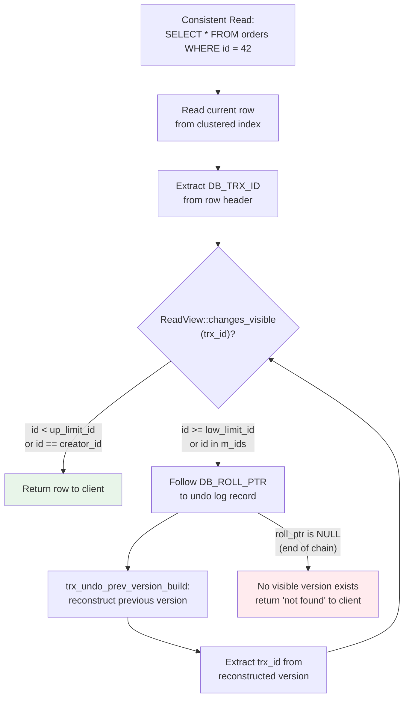

# 4. MVCC and the Transaction System

Chapter 2 introduced the three hidden system columns that occupy 13 bytes at the start of every InnoDB clustered index record. `DB_TRX_ID` identifies which transaction last modified the row. `DB_ROLL_PTR` encodes the undo tablespace location of the previous version. Those 13 bytes are not decorative metadata — they are the physical foundation of Multi-Version Concurrency Control (MVCC), the mechanism that allows a non-locking `SELECT` to read a consistent snapshot without acquiring a single row lock [^173^].

This chapter descends through the MVCC machinery layer by layer. We begin with transaction ID assignment and the global `trx_sys` structure that coordinates all transaction activity. We then examine the `ReadView` — a snapshot of global transaction state captured at a specific moment — and walk through the `changes_visible()` algorithm that determines, in at most three comparisons plus a binary search, whether a given row version is visible to a query. We follow the undo log version chains that reconstruct historical row versions when the current version is not visible. Finally, we compare the four isolation levels and close with the Aurora-specific behavior that makes this entire mechanism both powerful and dangerous: a read view on any reader instance can block purge for the entire cluster.

## 4.1 Transaction IDs and the Transaction System

### 4.1.1 Transaction ID Assignment

InnoDB assigns every read-write transaction a 48-bit unsigned integer identifier (`trx_id_t`). The maximum value is 2^48 − 1 = 281,474,976,710,655. At a sustained rate of 20,000 transactions per second, wraparound would require approximately 446 years [^162^]; in practice, transaction ID exhaustion is not an operational concern.

The global variable `trx_sys->max_trx_id` holds the next transaction ID to assign. It is declared `volatile` because it is accessed without mutex protection during auto-commit non-locking read-only view creation. IDs are assigned atomically via `trx_sys_get_new_trx_id()`:

```c
trx_sys_get_new_trx_id() {
    if (!(trx_sys->max_trx_id % TRX_SYS_TRX_ID_WRITE_MARGIN)) {
        trx_sys_flush_max_trx_id();  // Flush to disk every 256 IDs
    }
    return(trx_sys->max_trx_id++);
}
```

The write margin (`TRX_SYS_TRX_ID_WRITE_MARGIN = 256`) ensures that `max_trx_id` is flushed to the rollback segment header in the redo log every 256 assignments [^144^]. After a crash, the recovered `max_trx_id` is at least as large as any ID that was assigned to a committed transaction, preventing ID reuse that would corrupt MVCC visibility.

Read-only transactions that perform no writes receive `trx->id = 0`; they do not consume a real transaction ID. In `SHOW ENGINE INNODB STATUS`, these transactions appear with a pseudo-ID derived from the memory address of their `trx_t` structure (`reinterpret_cast<trx_id_t>(trx) | (max_trx_id + 1)`). This pseudo-ID is for display only and plays no role in visibility checking.

### 4.1.2 The trx_sys Structure

The `trx_sys_t` structure is the single global object that coordinates all transaction activity in InnoDB [^174^]. Its key fields are:

- `max_trx_id` — the next transaction ID to assign
- `rw_trx_ids` — a sorted list of active read-write transaction IDs
- `mvcc` — the MVCC manager, which maintains read view pools

The MVCC manager (`class MVCC`) maintains two linked lists of `ReadView` objects: `m_free`, containing inactive views available for reuse, and `m_views`, containing active views currently in use by transactions. When `trx_assign_read_view()` is called, the manager first attempts to recycle a view from `m_free`; if none is available, it allocates a new `ReadView` object, prepares it with the current transaction system state, and inserts it into `m_views` ordered by age (oldest first) [^14^].

### 4.1.3 Transaction States

Every transaction progresses through a well-defined state machine:

- `TRX_STATE_ACTIVE` — the transaction has started and may be executing statements or holding locks.
- `TRX_STATE_COMMITTED` — commit is complete in memory but not necessarily durable on disk.
- `TRX_STATE_ROLLING_BACK` — the transaction is being rolled back, either explicitly or because it was selected as a deadlock victim.

State transitions are protected by `trx->mutex`. A transaction in `COMMITTED` state is not "done" from an MVCC perspective until its undo records are moved to the history list and processed by purge.

## 4.2 Read Views and Visibility Checking

A ReadView is a snapshot of the global transaction state captured at a specific point in time. It determines which row versions are visible to a consistent read. Understanding the ReadView structure and the `changes_visible()` algorithm is essential for diagnosing MVCC-related performance problems.

### 4.2.1 ReadView Structure

The `ReadView` class captures four critical values:

| Field | Description | Operational Significance |
|---|---|---|
| `m_low_limit_id` | The next transaction ID to be assigned at snapshot time (`trx_sys->max_trx_id`) | The "high water mark." No transaction with `trx_id >= m_low_limit_id` committed before the snapshot. |
| `m_up_limit_id` | The minimum active (uncommitted) transaction ID at snapshot time, or `m_low_limit_id` if no transactions are active | The "low water mark." All transactions with `trx_id < m_up_limit_id` had already committed. |
| `m_ids` | Sorted array of active read-write transaction IDs at snapshot time | Used for O(log N) binary search to check whether a specific transaction was still active. |
| `m_creator_trx_id` | The transaction ID of the transaction that created this read view | The creator's own changes are always visible to itself. |

The `m_low_limit_no` field (not used in visibility checking) is the smallest committed transaction number at snapshot time; the purge thread uses it to determine which undo logs can be removed. When a read view is opened, `prepare()` copies the current `max_trx_id` into both `m_low_limit_id` and `m_low_limit_no`, records the creator's transaction ID, and copies the `rw_trx_ids` list into `m_ids`. Then `complete()` sets `m_up_limit_id` to the first element of `m_ids` (or to `m_low_limit_id` if `m_ids` is empty) and marks the view as active [^14^].

### 4.2.2 The changes_visible() Algorithm

The visibility check is the core of MVCC. For a given row version with transaction ID `id`, `ReadView::changes_visible()` executes the following logic:

```c
[[nodiscard]] bool changes_visible(trx_id_t id, const table_name_t &name) const {
    if (id < m_up_limit_id || id == m_creator_trx_id) return true;
    if (id >= m_low_limit_id) return false;
    return m_ids.empty() || !std::binary_search(m_ids.data(),
                                                 m_ids.data() + m_ids.size(), id);
}
```

The algorithm makes its decision in at most three comparisons plus an O(log N) binary search through `m_ids`, where N is the number of active transactions at snapshot time:

**ReadView Visibility Decision Matrix**

| Condition | Evaluation | Result | Meaning |
|---|---|---|---|
| `id < m_up_limit_id` | First check | **Visible** | The modifying transaction committed before the oldest still-active transaction at snapshot time. This row version is definitely committed and visible. |
| `id == m_creator_trx_id` | Second check | **Visible** | The current transaction always sees its own changes, regardless of commit status. This prevents a transaction from "disappearing" its own uncommitted updates. |
| `id >= m_low_limit_id` | Third check | **Not visible** | The modifying transaction started after this read view was created. By definition, it cannot have committed before the snapshot. |
| `id` found in `m_ids` | Binary search | **Not visible** | The modifying transaction was still active (uncommitted) at the exact moment the snapshot was taken. Its changes are not visible. |
| `id` not found in `m_ids` | Binary search | **Visible** | The modifying transaction committed before the snapshot was taken. It is not in the active set, so its changes are visible. |

Under high concurrency with hundreds or thousands of active transactions, the binary search step can become a CPU bottleneck, particularly on NUMA systems where the `m_ids` array may reside on a different socket from the querying thread [^118^]. However, for most production workloads the constant factors are small enough that visibility checking is not the dominant cost — version chain traversal through the undo log is.

If `changes_visible()` returns `false`, InnoDB does not return the current row version to the client. Instead, it follows the `DB_ROLL_PTR` to the undo log, reconstructs the previous version of the row, and checks that version against the same read view. This process repeats until a visible version is found or the chain ends (meaning no visible version exists for this row in the transaction's snapshot).

### 4.2.3 Read View Creation Timing

The timing of read view creation varies by isolation level, and this timing is the single most important factor in determining whether a transaction will block purge:

- **REPEATABLE READ** (the default): `trx_assign_read_view()` is called once, at the first `SELECT` within the transaction. The same read view is reused for every subsequent consistent read in that transaction [^129^]. If a transaction starts with an `UPDATE` or `DELETE` and then issues a `SELECT`, the read view is created at that `SELECT` and held until `COMMIT` or `ROLLBACK`.

- **READ COMMITTED**: `trx_assign_read_view()` is called at the start of every `SELECT` statement, creating a fresh read view each time [^129^]. Read views are short-lived and closed promptly after the statement completes.

On Aurora readers, this distinction has outsized consequences. A `REPEATABLE READ` transaction that runs for three hours on a reader holds a single read view for three hours. Because all instances share the same undo logs, that read view's `m_low_limit_no` becomes the global purge horizon — no undo records from transactions committed after that point can be removed anywhere in the cluster [^16^]. Switching reader applications to `READ COMMITTED` is the most effective single mitigation for Aurora MVCC-related incidents, because it limits each read view to the duration of a single statement [^15^].

## 4.3 Undo Logs and Version Chains

Undo logs serve two purposes: they provide the information needed to roll back a transaction, and they store the historical row versions that MVCC uses to reconstruct consistent snapshots. Only update undo logs participate in the version chain; insert undo logs are handled separately.

### 4.3.1 Insert Undo vs Update Undo

When a transaction performs an `INSERT`, InnoDB writes an **insert undo record** containing only the primary key of the new row. This record exists solely for rollback: if the transaction rolls back, InnoDB uses the primary key to locate and delete the inserted row. Once the transaction commits, no other transaction can ever need to see a "before" version of a row that did not exist, so insert undo records can be discarded immediately [^120^]. They do not participate in MVCC version chain traversal [^153^].

When a transaction performs an `UPDATE` or `DELETE`, InnoDB writes an **update undo record** containing the transaction ID that created the historical version, a roll pointer to the previous version of the row, and an update vector with the delta (the before-image of modified columns) [^153^]. These records must be preserved until no active transaction in the system could possibly need them to reconstruct an older row version for a consistent read [^120^].

The following Mermaid diagram illustrates the version chain traversal that occurs when a consistent read encounters a row version that is not visible in its read view:



The traversal begins at the current row in the clustered index. For each version, InnoDB extracts `DB_TRX_ID` and calls `changes_visible()`. If the version is not visible, it follows `DB_ROLL_PTR` to the undo log, calls `trx_undo_prev_version_build()` to reconstruct the previous version, and loops. The chain terminates when either a visible version is found or the roll pointer is `NULL`, indicating that the row did not exist at snapshot time.

### 4.3.2 Version Chain Traversal in Detail

The function `trx_undo_prev_version_build()` does the heavy lifting of historical version reconstruction. Its operation is:

1. Parse the roll pointer to locate the undo record (space ID, page number, offset).
2. If the undo record is of insert type, or the undo page has been purged, return failure (end of chain).
3. Parse the undo record to extract: `trx_id` (the transaction that created this historical version), `roll_ptr` (pointer to the version before this one), the primary key, and the update vector (the set of modified columns and their previous values).
4. Apply the update vector to the current record copy using `row_upd_rec_in_place()`, producing the historical version [^153^].

Each step may require a buffer pool access to read the undo page, followed by CPU work to apply the delta. When History List Length is high, a single row read can traverse dozens of versions, turning a sub-millisecond index lookup into a multi-millisecond CPU-bound operation [^16^]. The symptoms are unmistakable: `SELECT` statements suddenly take hundreds of milliseconds, CPU utilization rises even though the query plan has not changed, and query latency becomes erratic as different rows require different chain lengths.

### 4.3.3 Update Undo Record Subtypes

Update undo records have three subtypes, each with different implications for purge behavior:

- `TRX_UNDO_UPD_EXIST_REC` — a regular update of an existing record. During purge, if the update modified columns that participate in secondary indexes, the purge thread may need to clean up stale index entries.
- `TRX_UNDO_DEL_MARK_REC` — a delete-mark operation. The row has been marked as deleted but not yet physically removed. When purge processes this record, it physically removes the row from both the clustered index and all secondary indexes [^153^].
- `TRX_UNDO_UPD_DEL_REC` — an update of a delete-marked record (effectively an un-delete). This occurs when a transaction deletes a row and a later transaction re-inserts a row with the same primary key before purge has removed the old version.

The physical removal of delete-marked records during purge is one of the most expensive purge operations because it requires acquiring latch locks on both the clustered index page and every affected secondary index page. Under high write load with many deletions, this work can cause the purge thread to fall behind even without read view blocking.

## 4.4 Isolation Levels in Practice

MySQL supports four isolation levels, but only two are relevant for production Aurora workloads: `REPEATABLE READ` (the default) and `READ COMMITTED`. The choice between them determines read view lifetime, lock behavior, and — on Aurora — whether a reader can block cluster-wide purge.

**Isolation Levels Comparison**

| Property | READ UNCOMMITTED | READ COMMITTED | REPEATABLE READ | SERIALIZABLE |
|---|---|---|---|---|
| Dirty read | Allowed | Prevented | Prevented | Prevented |
| Non-repeatable read | Allowed | Allowed | Prevented | Prevented |
| Phantom read | Allowed | Allowed | Prevented* | Prevented |
| Read view behavior | None; reads latest version directly | Fresh read view per SELECT statement | Single read view at first SELECT, held for entire transaction | No MVCC; SELECTs become locking reads |
| Gap locks | None | None (except FK / dup key checks) | Next-key locks (record + gap) | Next-key locks |
| Consistent read overhead | Minimal | Moderate (view per statement) | Higher (view held for duration) | Highest (all reads acquire locks) |
| Aurora reader purge risk | N/A | Low (views are short-lived) | **High** (long-lived views block purge) | N/A (no consistent reads) |

*InnoDB prevents phantom reads at `REPEATABLE READ` through gap locks and next-key locks on locking reads (`SELECT ... FOR UPDATE`, `SELECT ... FOR SHARE`, `UPDATE`, `DELETE`) [^119^]. Pure consistent reads (non-locking `SELECT`) do not acquire gap locks, but because they operate on a single snapshot taken at the first read, phantom reads are still prevented for the snapshot itself — a later insert by another transaction simply will not appear in the snapshot.

The table above makes the tradeoffs explicit. `READ COMMITTED` is the recommended isolation level for Aurora reader instances because it limits read view duration to a single statement, virtually eliminating the risk of blocking purge. AWS documentation explicitly recommends this configuration for readers [^15^]. However, note that Aurora reader defaults still inherit `REPEATABLE READ`, so the change must be made explicitly — either by setting `session transaction isolation level read committed` in the application connection setup, or by configuring the reader's parameter group.

### 4.4.1 REPEATABLE READ — The Default

Under `REPEATABLE READ`, all consistent reads within a transaction operate on the snapshot established by the first such read [^129^]. This provides a strong consistency guarantee: if a transaction reads a row, then another transaction updates and commits that row, the first transaction will still see the original value on subsequent reads. This is the correct isolation level for financial transactions, inventory management, and any workload where a transaction must make decisions based on a stable view of the data.

The cost is that the read view — and all the undo records it may need — is held for the entire transaction duration. On the Aurora writer, this is manageable because long-running write transactions are typically avoided by design. On Aurora readers, it is dangerous: a reporting query that runs for hours holds a single read view for hours, preventing purge of every update committed across the cluster during that time [^16^]. A Japanese production incident reported HLL reaching 4,500,000 with an 18-hour growth cycle; investigation traced the cause to a single long-running `SELECT` on a reader instance [^136^].

### 4.4.2 READ COMMITTED — Recommended for Aurora Readers

Under `READ COMMITTED`, each consistent read receives its own fresh snapshot [^129^]. A transaction running three hours of `SELECT` statements creates and closes a read view for each statement. This prevents non-repeatable reads within a single statement but allows them across statements: if a row is read, then modified and committed by another transaction, then read again, the second read will see the new value.

The practical impact on Aurora readers is transformative. Because read views are short-lived, they rarely block purge for more than a few milliseconds. The tradeoff is weaker consistency across statements, which is acceptable for most analytical and reporting workloads. Additionally, `READ COMMITTED` disables gap locks (except for foreign key and duplicate key checks), reducing lock contention and improving write concurrency [^118^]. Lock scope is also reduced: rows that do not satisfy the query's `WHERE` condition have their locks released immediately after evaluation, rather than being held until transaction end [^121^].

An important performance subtlety: in low-conflict workloads, `REPEATABLE READ` can actually outperform `READ COMMITTED` because the overhead of copying the active transaction list into `m_ids` on every statement dominates. Under `REPEATABLE READ`, that copy happens once; under `READ COMMITTED`, it happens on every `SELECT` [^134^]. For Aurora readers, however, this micro-optimization is outweighed by the macro-risk of purge blocking.

### 4.4.3 Consistent Reads vs Locking Reads

Not all `SELECT` statements use MVCC. The distinction between consistent reads and locking reads determines whether a query sees a snapshot or the latest committed version:

**Consistent reads** (non-locking reads) are the default for `SELECT` at `READ COMMITTED` and `REPEATABLE READ`. They use MVCC and read views to access a snapshot without acquiring locks on the rows read [^129^]. Other sessions can freely modify the same rows while the consistent read is in progress.

**Locking reads** bypass MVCC and read the latest committed version while acquiring locks. There are two variants:

```sql
-- Exclusive lock: blocks other transactions from modifying or locking these rows
SELECT * FROM accounts WHERE id = 1 FOR UPDATE;

-- Shared lock: allows other shared locks, blocks exclusive locks
SELECT * FROM accounts WHERE id = 1 FOR SHARE;
```

Locking reads are used internally by `UPDATE`, `DELETE`, and `INSERT ... ON DUPLICATE KEY UPDATE`. If a locking read encounters a row modified by an uncommitted transaction, it waits until that transaction commits or rolls back [^131^]. At `SERIALIZABLE`, all plain `SELECT` statements are implicitly converted to `SELECT ... FOR SHARE` (when autocommit is disabled), abandoning MVCC entirely [^133^].

A common and dangerous pattern is mixing non-locking `SELECT` with subsequent DML on the same rows:

```sql
-- Check if rows exist (MVCC snapshot may be stale)
SELECT COUNT(c1) FROM t1 WHERE c1 = 'xyz';  -- Returns 0

-- Delete (locking read sees current version, finds rows)
DELETE FROM t1 WHERE c1 = 'xyz';              -- Deletes several rows
```

The `SELECT` sees a snapshot; the `DELETE` sees the current version. If another transaction inserted matching rows between the `SELECT` and the `DELETE`, the counts will disagree. The MySQL manual explicitly recommends using `SELECT ... FOR UPDATE` when consistency between a read check and a subsequent DML operation is required [^121^].

## 4.5 Aurora-Specific: How Reader Read Views Block Writer Purge

The most consequential Aurora-specific behavior for production operations is that the entire cluster — writer and all readers — shares a single set of undo logs on the shared storage volume [^77^]. In standard MySQL replication, the primary and replica each maintain independent undo logs; a long-running transaction on a replica only blocks purge on that replica's local undo space. In Aurora, a read view opened on any reader instance can block purge for the entire cluster [^16^].

The mechanism is straightforward once the MVCC machinery is understood. The purge thread maintains a special "purge view" (`purge_sys->view`), which is a clone of the oldest active read view in the system. The purge thread cannot remove any undo log records with a transaction commit number (`trx_no`) greater than or equal to this purge view's `m_low_limit_no`. If a reader opens a read view with `m_low_limit_no = 1,000,000,000` and holds it for three hours while the writer commits transactions 1,000,000,001 through 1,000,500,000, all undo records for those 500,000 transactions remain unpurged — on every instance in the cluster [^317^].

The operational symptoms cascade:

1. **HLL grows unbounded**: `RollbackSegmentHistoryListLength` rises into the hundreds of thousands or millions.
2. **SELECT performance degrades cluster-wide**: Every query that touches recently modified rows must traverse longer version chains [^16^].
3. **CPU usage rises**: Version chain reconstruction consumes CPU on both the writer and readers.
4. **Storage bloat**: Undo tablespaces grow as space cannot be reclaimed.
5. **Reader restart risk**: When the offending read view is finally closed, the purge thread works at maximum speed. Aurora readers may not be able to catch up to the sudden burst of write activity and are restarted by the health monitor [^16^].

To identify which instance is holding the oldest read view:

```sql
-- Run on the writer instance
SELECT
    server_id,
    IF(session_id = 'master_session_id', 'writer', 'reader') AS role,
    replica_lag_in_msec,
    oldest_read_view_trx_id,
    oldest_read_view_lsn
FROM mysql.ro_replica_status;
```

The instance with the lowest (oldest) `oldest_read_view_trx_id` is blocking purge [^59^]. If a reader shows a value significantly older than the writer, that reader is the problem. The remediation is to kill the offending query or session on that reader — not to reboot it, as rebooting loses the survivable page cache and forces purge to read undo pages from storage, which is slower and incurs I/O billing costs [^59^].

A reader holding an old read view can also cause apparent "missing data" on that reader: because the read view predates recently committed writes, the reader will not see data that exists on the writer. The simple solution is to close the session and open a new one, which creates a fresh read view [^16^].

For prevention, the operational playbook is:

1. **Set `READ COMMITTED` on all reader connections** unless `REPEATABLE READ` is strictly required for correctness.
2. **Monitor `RollbackSegmentHistoryListLength`** as a P1 metric with an alert threshold of 100,000.
3. **Run the `ro_replica_status` query** proactively during incident response when HLL is elevated.
4. **Kill long-running queries on readers** before they become multi-hour transactions.
5. **Never reboot** to resolve high HLL — kill the offending transaction and let purge work from the warm cache instead.

The mechanism that makes MVCC beautiful — undo logs preserving old row versions so that readers never wait for writers — also creates a garbage collection problem. When cleanup fails, the consequences cascade across the entire cluster. Chapter 5 examines the purge system: InnoDB's garbage collector, and Aurora's silent killer.


## References

[^15^]: [AWS Documentation, "Doublewrite Buffer Elimination in Aurora."](https://docs.aws.amazon.com/AmazonRDS/latest/AuroraUserGuide/AuroraMySQL.Managing.Performance.html)
[^16^]: [AWS Documentation, "Checkpointing in Standard MySQL vs Aurora."](https://docs.aws.amazon.com/AmazonRDS/latest/AuroraUserGuide/AuroraMySQL.Managing.Monitoring.html)
[^59^]: [AWS Documentation, "Aurora MySQL Wait Events."](https://docs.aws.amazon.com/AmazonRDS/latest/AuroraUserGuide/AuroraMySQL.Managing.Monitoring.html)
[^134^]: [AWS Documentation, "Aurora Global Database RTO/RPO."](https://docs.aws.amazon.com/AmazonRDS/latest/AuroraUserGuide/aurora-global-database.html)
