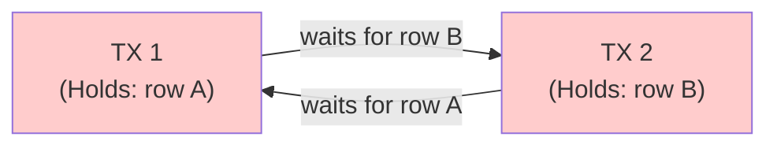

# 6. Locking, Deadlocks, and Concurrency Control

Chapters 4 and 5 established how InnoDB handles reads and cleanup. MVCC gives consistent reads a snapshot without locks, and the purge system garbage-collects old versions when no transaction needs them. But what about writes? When transactions modify data — `UPDATE`, `DELETE`, `SELECT... FOR UPDATE` — they cannot simply coexist. Writers need exclusive access to the rows they change, and the mechanism that provides it is locking.

Aurora MySQL inherits InnoDB's row-level locking subsystem almost unchanged, but the shared-storage architecture introduces cluster-level effects that standard MySQL DBAs rarely encounter. A deadlock on the writer is local to that instance, yet a long-running transaction on any reader can block purge for the entire cluster — amplifying the very lock contention that produces deadlocks in the first place. This chapter maps the lock type hierarchy, explains how InnoDB's deadlock detector works (and when to disable it), and provides the exact SQL queries and CloudWatch commands needed to diagnose production lock incidents.

## 6.1 Lock Types and Hierarchy

### 6.1.1 Shared (S) and Exclusive (X) Locks

InnoDB implements two fundamental row-level lock modes. A **shared (S) lock** permits concurrent reads; multiple transactions can hold S locks on the same row simultaneously. An **exclusive (X) lock** grants sole access for update or delete operations; no other transaction can acquire any lock on the row while an X lock is held. S locks are acquired by `SELECT... FOR SHARE` and some foreign-key checks. X locks are acquired by `UPDATE`, `DELETE`, and `SELECT... FOR UPDATE`. Consistent reads (plain `SELECT`) use MVCC and acquire no row locks at all.

### 6.1.2 Intention Locks (IS, IX)

**Intention locks** are table-level locks that indicate which row-level lock type a transaction intends to acquire. Before locking any row, a transaction must obtain an intention lock on the containing table: **Intention Shared (IS)** signals intent to set S locks; **Intention Exclusive (IX)** signals intent to set X locks. When DDL requests a table-level X lock, InnoDB checks only the intention lock bitmap — it does not scan rows for conflicts. IS and IX are compatible with each other, but both conflict with table-level S and X locks.

| Requested \ Held | X | S | IX | IS |
|:---|:---:|:---:|:---:|:---:|
| **X** | Conflict | Conflict | Conflict | Conflict |
| **S** | Conflict | Compatible | Conflict | Compatible |
| **IX** | Conflict | Conflict | Compatible | Compatible |
| **IS** | Conflict | Compatible | Compatible | Compatible |

This matrix explains why `LOCK TABLES... READ` on a busy OLTP table is catastrophic: the table-level S lock blocks IX, serializing all writers. ETL jobs and schema migration tools targeting the Aurora writer can trigger exactly this scenario. Monitor for `lock_wait_timeout` on metadata locks when such tools run.

### 6.1.3 AUTO-INC Locks

InnoDB manages auto-increment columns via `innodb_autoinc_lock_mode`:

- **Mode 0 (Traditional)**: Table-level AUTO-INC lock held for the entire `INSERT` statement. Consecutive IDs guaranteed, but all inserts serialize.
- **Mode 1 (Consecutive)**: "Simple inserts" use a lightweight mutex; bulk inserts still acquire the table lock. Default before MySQL 8.0.
- **Mode 2 (Interleaved)**: No table-level AUTO-INC locks; a lightweight mutex always suffices. **Default in Aurora MySQL 3.x**. Maximum insert concurrency, but allows gaps in sequences and requires row-based replication.

Mode 2 is correct for virtually all Aurora OLTP workloads. Revert to Mode 1 only if the application requires gap-free auto-increment values — a dependency that usually indicates a schema design issue rather than a genuine requirement.

## 6.2 Row-Level Locking Internals

### 6.2.1 Record Locks

A **record lock** (`LOCK_REC_NOT_GAP`) locks a specific index record and nothing else. Record locks are acquired on unique-index equality lookups and at `READ COMMITTED` where gap locking is disabled. InnoDB implements them using a bitmap within the lock struct — one lock object per index page, with bits set for affected records. This means `TRX_ROWS_LOCKED` understates actual memory use; the lock struct heap size in `SHOW ENGINE INNODB STATUS` is the more accurate metric.

Record locks do **not** prevent inserts into adjacent gaps. If Transaction A holds a record lock on `(id=10)`, Transaction B can insert `(id=9)` without conflict. This property is what makes `READ COMMITTED` attractive for insert-heavy workloads: with gap locking disabled, only record locks remain, and concurrent inserts into non-conflicting records proceed without serialization.

### 6.2.2 Gap Locks

A **gap lock** (`LOCK_GAP`) locks the space between index records. Gap locks are "purely inhibitive" — they exist only to prevent inserts into the gap. They do not conflict with each other, and there is no S/X distinction for gap locks. Gap locking prevents phantom reads in `REPEATABLE READ`; at `READ COMMITTED` it is disabled (except for foreign-key and duplicate-key checks), which reduces deadlocks at the cost of allowing phantoms.

In Aurora, gap locks are instance-local — they do not propagate to readers, which use MVCC. A gap lock on the writer blocks only concurrent writers. This instance-local property means that even with 15 readers attached to the same storage volume, gap lock contention is limited to the writer's transaction pool. The practical limit on writer concurrency becomes the relevant bottleneck, not the total cluster size.

### 6.2.3 Next-Key Locks

A **next-key lock** (`LOCK_ORDINARY`) combines a record lock with a gap lock on the preceding gap. This is the default lock mode for `SELECT... FOR UPDATE` and `UPDATE`/`DELETE` range scans at `REPEATABLE READ`. For index values 10, 11, 13, and 20, next-key locks cover `(negative infinity, 10]`, `(10, 11]`, `(11, 13]`, `(13, 20]`, and `(20, positive infinity)`.

When Transaction A runs `SELECT * FROM orders WHERE id BETWEEN 100 AND 200 FOR UPDATE`, InnoDB places next-key locks on every record in that range plus the gaps. Transaction B's `INSERT` into the same range blocks — and if A simultaneously needs a lock B holds, a deadlock forms. This **range-scan-vs-insert** pattern is among the most common deadlock scenarios in production Aurora workloads.

### 6.2.4 Insert Intention Locks

An **insert intention lock** (`LOCK_X | LOCK_GAP | LOCK_INSERT_INTENTION`) is set immediately before inserting a row. Multiple transactions can hold insert intention locks on the same gap if inserting at different positions, but each must wait for existing gap locks or next-key locks on the range. This is why `INSERT` blocks behind `SELECT... FOR UPDATE` range scans.

The complete lock compatibility evaluated by `lock_rec_has_to_wait()` reveals the asymmetric conflicts:

| Requested \ Held | LOCK_ORDINARY | LOCK_GAP | LOCK_GAP + INSERT_INTENTION | LOCK_REC_NOT_GAP |
|:---|:---:|:---:|:---:|:---:|
| **LOCK_ORDINARY** | Conflict | Compatible | Compatible | Conflict |
| **LOCK_GAP** | Compatible | Compatible | Compatible | Compatible |
| **LOCK_GAP + INSERT_INTENTION** | Conflict | Conflict | Compatible | Compatible |
| **LOCK_REC_NOT_GAP** | Conflict | Compatible | Compatible | Conflict |

The critical insight: **insert intention locks conflict with next-key locks and gap locks, but not with record locks or other insert intention locks**. When multiple transactions upsert into overlapping ranges, insert intention locks pile up behind next-key locks, creating wait chains that the deadlock detector must resolve.

## 6.3 Deadlock Detection and Resolution

### 6.3.1 Wait-For Graph Construction

InnoDB maintains an internal **wait-for graph**: nodes are active transactions, edges are wait relationships (A waits for B to release a lock). A cycle signals deadlock. Detection uses depth-first search (DFS) performed by a background thread.



*Figure 6.1: A minimal wait-for graph cycle. Transaction 1 holds row A and waits for row B; Transaction 2 holds row B and waits for row A. DFS from either node discovers the cycle.*

In MySQL before 8.0.18 (Aurora MySQL 2.x), deadlock detection ran synchronously in `add_to_waitq`, holding the global `lock_sys` mutex for the entire DFS. Under high contention, detection itself became a bottleneck. MySQL 8.0.18 redesigned the system: detection moved to a **dedicated background thread** that captures a snapshot of wait relationships, runs DFS on the snapshot without holding the mutex, then reacquires the mutex only to verify candidates before rollback. Aurora MySQL 3.x inherits this improvement, eliminating the "deadlock detection storm" that could freeze the lock subsystem in 2.x.

### 6.3.2 Victim Selection

When a cycle is confirmed, InnoDB selects a victim using a **weight heuristic**: transaction priority, rows modified (smaller preferred), and locks held. The goal is to minimize rollback cost. A transaction that modified 100 rows is a better victim than one that modified 10,000 — undoing the smaller change set is cheaper.

### 6.3.3 The innodb_deadlock_detect Tradeoff

For ultra-high concurrency workloads, disabling deadlock detection can improve throughput:

```sql
SET GLOBAL innodb_deadlock_detect = OFF;
```

With detection off, deadlocks resolve via `innodb_lock_wait_timeout` (default 50s). The tradeoff:

| Mode | Deadlock Latency | Resource Waste | CPU Overhead | Recommended For |
|:---|:---|:---|:---|:---|
| `ON` (default) | Immediate | Minimal | Background thread | General OLTP; Aurora 3.x default |
| `OFF` | Up to 50s timeout | Locks held for full timeout | None from detection | >1,000 concurrent writers on same rows |

The MySQL team recommends keeping detection **ON** in 8.0.18+ because the background thread is fast and non-blocking. Disable it only after profiling confirms `lock_deadlock_rounds` correlates with throughput degradation. Even then, prefer reducing gap lock contention — by switching to `READ COMMITTED` or adding targeted indexes — before disabling the detector. The one workload profile where `OFF` consistently wins is a high-frequency queue table where thousands of connections compete for the same small set of rows; in this case, the wait-for graph grows so dense that snapshot capture itself becomes expensive.

A critical detail: when `innodb_lock_wait_timeout` fires, InnoDB rolls back **only the current statement**, not the entire transaction. A transaction with two `UPDATE`s where the second times out leaves the first committed if the application issues `COMMIT` — a silent atomicity violation. To prevent this:

```ini
# my.cnf — requires restart
innodb_rollback_on_timeout = ON
```

## 6.4 Monitoring and Production Debugging

### 6.4.1 Lock Monitoring Tables

In Aurora MySQL 3.x, `performance_schema.data_locks` and `data_lock_waits` replace the deprecated `INFORMATION_SCHEMA.INNODB_LOCKS` and `INNODB_LOCK_WAITS`. The `data_locks` table shows one row per held and waiting lock with type, mode, status (`GRANTED` or `WAITING`), and lock data. The `data_lock_waits` table maps waiting locks to their blockers.

```sql
-- Active lock waits with transaction and query details
SELECT
 r.trx_id AS waiting_trx,
 r.trx_mysql_thread_id AS waiting_thread,
 LEFT(r.trx_query, 80) AS waiting_query,
 TIMESTAMPDIFF(SECOND, r.trx_wait_started, NOW()) AS wait_seconds,
 b.trx_id AS blocking_trx,
 b.trx_mysql_thread_id AS blocking_thread,
 LEFT(b.trx_query, 80) AS blocking_query,
 dl.LOCK_MODE AS waiting_lock_mode,
 dl.LOCK_DATA AS waiting_on_key
FROM performance_schema.data_lock_waits w
JOIN information_schema.innodb_trx r
 ON r.trx_id = w.REQUESTING_ENGINE_TRANSACTION_ID
JOIN information_schema.innodb_trx b
 ON b.trx_id = w.BLOCKING_ENGINE_TRANSACTION_ID
JOIN performance_schema.data_locks dl
 ON dl.ENGINE_LOCK_ID = w.REQUESTING_ENGINE_LOCK_ID
ORDER BY wait_seconds DESC;
```

Values above 10 seconds in `wait_seconds` warrant immediate investigation. For a quick summary with kill commands:

```sql
SELECT waiting_pid, blocking_pid,
 sql_kill_blocking_query, sql_kill_blocking_connection
FROM sys.innodb_lock_waits;
```

When the blocking query is `NULL` (idle session holding locks):

```sql
-- Last statement from an idle blocking session
SELECT THREAD_ID, SQL_TEXT
FROM performance_schema.events_statements_history
WHERE THREAD_ID = (
 SELECT THREAD_ID FROM performance_schema.threads
 WHERE PROCESSLIST_ID = <blocking_pid>
)
ORDER BY TIMER_END DESC LIMIT 1;
```

### 6.4.2 SHOW ENGINE INNODB STATUS

`SHOW ENGINE INNODB STATUS` provides a point-in-time snapshot. The **TRANSACTIONS** section shows: the transaction ID counter, history list length (unpurged undo pages), and per-session active transactions with lock struct count, heap size, row lock count, and current query. Look for `LOCK WAIT` status to identify blocked transactions.

The **LATEST DETECTED DEADLOCK** section shows the most recent deadlock only (overwritten on each detection). Read it top-to-bottom within each transaction block: first what the transaction holds, then what it waits for. The victim line reads `WE ROLL BACK TRANSACTION (N)`. If the output contains `TOO DEEP OR LONG SEARCH IN THE LOCK TABLE WAITS-FOR GRAPH`, the wait-for list exceeded 200 transactions or 1,000,000 locks — treated as a deadlock with the checking transaction rolled back.

When the `LATEST DETECTED DEADLOCK` section shows both transactions holding `LOCK_ORDINARY` (next-key locks) and waiting on `LOCK_GAP + INSERT_INTENTION`, you are looking at a gap-lock upsert deadlock — switch to `READ COMMITTED` or `SKIP LOCKED`. If both transactions hold `LOCK_REC_NOT_GAP` (record locks only) on different rows, you have a reverse-order update pattern — enforce consistent access ordering in the application.

### 6.4.3 Proactive Setup: Deadlock Logging and Trend Analysis

`SHOW ENGINE INNODB STATUS` shows only the most recent deadlock. Capture all deadlocks persistently:

```sql
SET GLOBAL innodb_print_all_deadlocks = ON;
SET GLOBAL log_error_verbosity = 3; -- Complete output on MySQL 8.0.4+
```

All deadlocks then stream to the MySQL error log, which Aurora forwards to CloudWatch Logs automatically. For historical trending and correlation with deployment events, use `pt-deadlock-logger`:

```bash
pt-deadlock-logger --host aurora-writer.cluster-xxx.us-east-1.rds.amazonaws.com \
 --dest h=localhost,D=percona,t=deadlocks --interval 30 --run-time 7d
```

The resulting table stores timestamps, victim transactions, and waiting queries, enabling trend queries such as deadlocks-per-hour-by-table or pre/post-deployment frequency comparisons. This is especially valuable during incident post-mortems when `SHOW ENGINE INNODB STATUS` has already been overwritten by newer deadlocks.

Enable lock metrics for quantitative tracking:

```sql
SET GLOBAL innodb_monitor_enable = 'lock_%';
SELECT NAME, COUNT FROM information_schema.INNODB_METRICS
WHERE NAME LIKE 'lock_deadlock%' OR NAME LIKE 'lock_timeout%';
```

| Metric | Description | Alert Threshold |
|:---|:---|:---|
| `lock_deadlocks` | Total deadlocks since server start | > 10/hour sustained |
| `lock_timeouts` | Total lock wait timeouts | > 5/hour |
| `lock_deadlock_false_positives` | Spurious candidates from heuristic | Rising trend indicates graph complexity |
| `lock_deadlock_rounds` | Wait-for graph scan iterations | Correlate with CPU spikes |
| `lock_threads_waiting` | Threads currently waiting for locks | > 20 for > 60 seconds |

### 6.4.4 Common Deadlock Patterns

| Pattern | Trigger | Signature in Deadlock Output | Resolution |
|:---|:---|:---|:---|
| **Gap lock upserts** | Multiple `INSERT... ON DUPLICATE KEY UPDATE` on overlapping ranges | `lock_mode X locks gap before rec insert intention waiting` | Use `READ COMMITTED`; add `SKIP LOCKED`; shard key space |
| **Reverse-order updates** | A updates row 1 then 2; B updates row 2 then 1 | Two `lock_mode X locks rec but not gap` waits on different IDs | Enforce consistent row access order |
| **FK cascading locks** | Parent `UPDATE` triggers child table index check | Locks on parent and child tables | Index all FK columns; defer checks where possible |
| **Range scan vs insert** | `SELECT... FOR UPDATE` range collides with concurrent `INSERT` | One holds `LOCK_ORDINARY`; other waits with `insert intention` | Narrow range; use `READ COMMITTED`; equality on unique index |

**Gap lock upserts** are the most prevalent in high-throughput Aurora. When connections batch-insert into overlapping key ranges, insert intention locks queue behind next-key locks. Even when inserting different rows, if they fall within the same next-key interval, the transactions serialize and deadlock.

**Reverse-order updates** persist because row access order is rarely enforced across all code paths. Define a canonical ordering (e.g., ascending primary key) and enforce it via code review.

**Foreign key cascading locks** are insidious: `UPDATE parent SET status='archived'` acquires locks on the child table's FK index even though the application never touched the child table. If the FK column is unindexed, InnoDB scans the entire child table. A single `UPDATE` on a non-indexed column can hold 218,786 row locks with a 96,696-byte heap.

**Range scan vs insert** is the most amenable to isolation-level tuning. Switching to `READ COMMITTED` disables gap locking for searches, converting next-key locks to record locks and eliminating the insert intention conflict. The tradeoff is phantom reads — acceptable for most OLTP where queries target specific keys.

```sql
SET SESSION TRANSACTION ISOLATION LEVEL READ COMMITTED;
```

For queue-processing, use `SKIP LOCKED` to eliminate wait-for edges entirely:

```sql
SELECT id, payload FROM jobs WHERE status = 'pending'
ORDER BY created_at LIMIT 1 FOR UPDATE SKIP LOCKED;
```

Use `NOWAIT` when immediate failure is preferable to waiting:

```sql
SELECT * FROM inventory WHERE item_id = 1 FOR UPDATE NOWAIT;
-- Returns error 3572 immediately if locked
```

### 6.4.5 CloudWatch Integration

Aurora exposes lock metrics through CloudWatch without additional instrumentation:

```bash
# Deadlocks per hour
aws cloudwatch get-metric-statistics --namespace AWS/RDS \
 --metric-name Deadlocks \
 --dimensions Name=DBClusterIdentifier,Value=production-cluster \
 --start-time 2025-01-01T00:00:00Z --end-time 2025-01-02T00:00:00Z \
 --period 3600 --statistics Sum

# Blocked transactions
aws cloudwatch get-metric-statistics --namespace AWS/RDS \
 --metric-name BlockedTransactions \
 --dimensions Name=DBClusterIdentifier,Value=production-cluster \
 --start-time 2025-01-01T00:00:00Z --end-time 2025-01-02T00:00:00Z \
 --period 3600 --statistics Average
```

Performance Insights surfaces `synch/cond/innodb/row_lock_wait_cond` for row-level lock wait time. The Top SQL tab shows blocked queries but may miss the blocker if it completed its statement and is now idle. Use the `sys.innodb_lock_waits` query from Section 6.4.1 to identify both sides. Set a CloudWatch alarm on `Deadlocks` with a threshold of > 10 per hour sustained over two evaluation periods to catch emerging contention before it cascades into `BlockedTransactions` spikes.

For long-running transaction detection — the leading cause of lock accumulation:

```sql
SELECT trx_id, trx_mysql_thread_id, LEFT(trx_query, 80) AS query_preview,
 TIMESTAMPDIFF(SECOND, trx_started, NOW()) AS trx_seconds,
 trx_rows_locked, trx_rows_modified
FROM information_schema.innodb_trx
WHERE TIMESTAMPDIFF(SECOND, trx_started, NOW()) > 60
ORDER BY trx_started;
```

Run this query on a schedule via the Event Scheduler or an external monitoring cron. In Aurora, extend monitoring to readers via `mysql.ro_replica_status` to catch cross-instance read views that block purge and amplify lock contention cluster-wide [^59^]:

```sql
SELECT server_id,
 IF(session_id = 'master_session_id', 'writer', 'reader') AS role,
 replica_lag_in_msec,
 oldest_read_view_trx_id
FROM mysql.ro_replica_status;
```

A reader with a very old `oldest_read_view_trx_id` relative to the writer is likely blocking purge. Kill the offending session on that reader before the history list length grows large enough to degrade queries across the entire cluster.

---

We've now explored the complete transaction engine: how reads work (MVCC), how cleanup works (purge), and how writes are coordinated (locks). The three chapters of this part trace a single arc — from the 13 hidden bytes on every row that encode transaction lineage, through the read views that decide which versions are visible, to the purge system that must clean them up, and finally to the locks that prevent concurrent writes from corrupting the data. Each mechanism is elegant in isolation; together, they form the most sophisticated concurrency control system in production database engineering.

But how do changes actually survive? Part III follows a write from the buffer pool, through the redo log, to storage, and out to replicas.


## References

[^59^]: [AWS Documentation, "Aurora MySQL Wait Events."](https://docs.aws.amazon.com/AmazonRDS/latest/AuroraUserGuide/AuroraMySQL.Managing.Monitoring.html)
