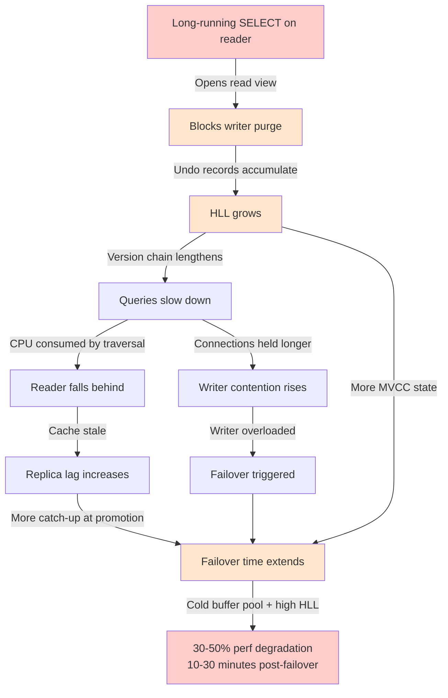

# Chapter 13: Integrated Production Strategies

This chapter has no new facts. It has only connections — the patterns that emerge when you hold all thirteen chapters in your head at once.

The preceding twelve chapters examined Aurora MySQL's internals dimension by dimension. Each revealed its own failure modes and tuning strategies. But production incidents rarely respect those boundaries. A long-running analytical query on a reader blocks purge cluster-wide, the history list length grows, query latency degrades, and when the overloaded writer finally fails over, the promoted reader starts with a cold buffer pool and a months-long undo backlog. The cascade touches every subsystem.

This chapter maps four cross-dimensional patterns that separate teams who survive Aurora from teams who struggle with it. Each pattern draws on multiple preceding chapters. The references are explicit because the connections are the point.

## 13.1 The Purge-HLL-Replica Lag-Failover Nexus

The most dangerous failure mode in Aurora MySQL is not a single-component failure. It is a cascading interaction between four nominally independent subsystems — purge, history list length, replica lag, and failover — that amplifies a single long-running query into a cluster-wide availability event.

### How the Four Subsystems Interconnect

Aurora's shared storage means all instances read from the same volume and share a single undo log [^7^][^8^]. In standard MySQL, each instance has isolated undo logs — a reader cannot affect the writer's purge. In Aurora, a read view opened on any reader blocks the writer's purge for the entire cluster [^16^]. This is the opposite of the isolation that separate instances nominally provide [^15^]. Chapter 4 established the MVCC read view mechanism; Chapter 5 traced how those read views become cluster-wide purge blockers.

When purge is blocked, old row versions accumulate. The `RollbackSegmentHistoryListLength` (HLL) metric — the count of un-purged undo records — climbs. HLL below 1,000 is healthy; 1,000–10,000 means purge is falling behind; above 100,000 causes measurable query slowdown as reads traverse longer version chains [^317^]. A documented production case reached 4,500,000 HLL from a single long-running `SELECT` on a reader [^331^]. Chapter 5 documented this cascade in detail; Chapter 10 provided the monitoring thresholds that detect it before it becomes critical.

As HLL grows, queries slow down. Slow queries hold connections longer, increasing `Threads_running`. Readers fall behind the writer, `AuroraReplicaLag` rises (Chapter 8), and this lag extends failover time because the promoted reader must reconcile its cache state before accepting full write load [^15^]. When failover occurs, the promoted reader starts cold — survivable page cache (Chapter 3) warms the *same* instance across restarts, but does not transfer to a *different* promoted instance [^57^]. Cluster Cache Management, which pre-warms failover targets, is PostgreSQL-only [^334^]. The promoted Aurora MySQL reader faces a triple penalty: cold cache, elevated HLL, and replica lag. Expect 30–50% degradation for 10–30 minutes.



The diagram captures the complete causal chain. Notice that there are two paths into failover: the organic path where writer degradation triggers it, and the operational path where an administrator initiates it to escape the degradation. Both lead to the same cold-cache outcome. This is the structural disadvantage that no single-parameter tuning can fully eliminate — it is inherent to Aurora MySQL's architecture.

### Early Warning Signs

The cascade does not appear suddenly. It builds over hours or days, and the warning signs are visible to operators who know where to look.

The earliest signal is a gradual HLL increase with no correlating long-running transaction on the writer. A sustained upward trend over 30 minutes — even below 10,000 — indicates an old read view somewhere in the cluster. Run `SELECT * FROM mysql.ro_replica_status` [^16^] immediately; it reveals which reader is blocking purge.

The second sign is divergence between `AuroraReplicaLag` and actual health. Chapter 8 established that `AuroraReplicaLag` measures cache update delay, not transaction lag [^351^]. A reader can show `< 20` ms lag while blocking purge cluster-wide. This is the monitoring inversion in action: a healthy-looking metric masks a critical problem.

The third pattern is increasing `io/aurora_redo_log_flush` waits with flat throughput — the dedicated commit thread (Chapter 7) is saturated from undo pressure [^22^]. In standard MySQL this signals disk I/O saturation; in Aurora it signals commit thread saturation from version chain pressure.

Correlation across these three signals provides hours of warning before the cascade becomes an outage. The operator who notices rising HLL, checks `mysql.ro_replica_status`, and kills the blocking query before HLL crosses 100,000 prevents a cluster-wide degradation event. The operator who waits for the CPU alert learns about the problem too late.

### Emergency Response Runbook

When HLL crosses 100,000 and is climbing, the response follows a structured sequence.

**Step 1: Identify the blocking transaction.** Execute on the writer:

```sql
-- Show which readers hold old read views blocking purge
SELECT 
    server_id,
    oldest_read_view_trx_id,
    oldest_read_view_trx_started,
    NOW() - oldest_read_view_trx_started AS view_age
FROM mysql.ro_replica_status
WHERE oldest_read_view_trx_id IS NOT NULL
ORDER BY view_age DESC;
```

This query returns the reader instance ID, the oldest transaction ID visible to that reader, when it started, and its age. The reader with the largest `view_age` is the purge blocker [^16^].

**Step 2: Identify the specific query on the blocking reader.** Connect to the identified reader and run:

```sql
-- Find the long-running transactions on the reader
SELECT 
    trx_id,
    trx_mysql_thread_id,
    trx_state,
    TIMESTAMPDIFF(SECOND, trx_started, NOW()) AS trx_seconds,
    trx_tables_locked,
    trx_rows_locked
FROM information_schema.innodb_trx
ORDER BY trx_started ASC
LIMIT 5;
```

Join with `information_schema.processlist` or `performance_schema.threads` to identify the query text and application connection.

**Step 3: Evaluate kill versus wait.** If the query is a non-essential analytical report, ad-hoc analysis, or backup operation, kill it immediately with `KILL <trx_mysql_thread_id>`. The purge thread will resume within seconds, and HLL will begin falling. If the query is business-critical and cannot be interrupted, the decision is harder. Killing it causes the application to fail; waiting causes the entire cluster to degrade. There is no automatic Aurora mechanism to resolve this tradeoff — it requires human judgment. Document the decision and its rationale for post-incident review.

**Step 4: Post-incident purge verification.** After the blocking transaction is released, monitor HLL every 60 seconds until it returns to the pre-incident baseline. Do not declare the incident resolved when HLL merely stops rising — it must be actively decreasing. Large HLL backlogs can take hours to fully clear even after purge resumes, because the purge thread must scan and discard each accumulated undo record. During this window, query performance may remain degraded. If HLL was in the millions, consider a scheduled maintenance window to allow uninterrupted purge completion.

```sql
-- Post-incident monitoring: HLL trend over time
SELECT 
    VARIABLE_VALUE AS hll,
    NOW() AS sampled_at
FROM information_schema.global_status
WHERE VARIABLE_NAME = 'RollbackSegmentHistoryListLength';
```

A critical operational rule: never reboot an instance to "fix" high HLL. Rebooting a reader that holds an old read view releases the view and allows purge to resume, but it also interrupts all queries on that reader and triggers cache repopulation. If the writer is rebooted, the failover mechanism promotes a reader — which may itself be a purge blocker — creating a new problem while solving nothing [^317^].

## 13.2 The Parameter Delusion Revisited

Standard MySQL tuning involves adjusting dozens of parameters — `innodb_log_file_size`, `innodb_flush_log_at_trx_commit`, `innodb_io_capacity`, `innodb_doublewrite`, and many more. Aurora renders approximately 15 of these either locked, not applicable, or irrelevant [^25^][^23^][^MyDBOps^]. Chapter 7 established why: log file size is not applicable (storage handles logs) [^25^], `innodb_flush_log_at_trx_commit` has limited impact due to async commits [^23^], `innodb_io_capacity` is locked at 200/2000 [^MyDBOps^], and the doublewrite buffer is eliminated [^16^]. Chapter 12 cataloged the complete list with tuning guidance for the parameters that remain.

The parameter delusion is not merely that DBAs waste time on irrelevant knobs — it is that the few tunable parameters have disproportionately high impact because everything else is automated. In standard MySQL, a mis-tuned parameter causes gradual degradation that others can partially offset. In Aurora, `innodb_buffer_pool_size` is the dominant performance factor, and getting it wrong has immediate consequences [^66^]. The default 75% of `DBInstanceClassMemory` is appropriate for most workloads. Increasing it risks OOM (Aurora has no swap and three memory-consuming processes) [^101^]. Decreasing it causes I/O amplification. Similarly, `innodb_purge_threads` — defaulting to 1 on instances with ≤16 logical processors, 4 on larger [^317^] — controls undo reclamation and directly affects the HLL cascade from Section 13.1. `innodb_lock_wait_timeout` controls gap lock behavior under high concurrency (Chapter 6). Each is make-or-break because no other levers exist.

Aurora DBA training should de-emphasize InnoDB parameter tuning and emphasize three operational domains. First, **buffer pool sizing**: know the 75% default, OOM risk from over-allocation, and under-allocation symptoms (falling `BufferCacheHitRatio`, rising `VolumeReadIOPS`). Second, **connection management**: Aurora's `max_connections` formula produces theoretical maximums 5-10x higher than practical limits. Use RDS Proxy before approaching the practical limits; alert at 80% of the *practical* limit. Third, **purge monitoring**: the most impactful skill for an Aurora DBA is reading `mysql.ro_replica_status`, interpreting HLL trends, and enforcing query timeouts on readers. Custom endpoints isolating analytical workloads are an availability requirement, not a performance optimization [^331^].

## 13.3 Aurora MySQL vs Aurora PostgreSQL: Architecture Decision Guide

Both Aurora engines share the same distributed storage foundation — six-way replication, quorum writes, and log-structured storage. But the database engines differ in ways that directly affect failover behavior, query plan stability, and operational complexity. Chapter 8 touched on failover; Chapter 9 covered query plan management. This section consolidates those insights into a decision framework.

### Failover Performance: Cluster Cache Management

Aurora PostgreSQL has Cluster Cache Management (CCM), which transfers cache state to the failover target — the promoted reader has a pre-warmed buffer pool [^334^]. Aurora MySQL has no equivalent. Survivable page cache keeps the *same* instance warm across restarts, but when a *different* instance is promoted, it starts cold [^57^]. Expect 30-50% degradation for 10-30 minutes after Aurora MySQL failovers [^334^].

For applications that cannot tolerate a 30-minute performance dip, PostgreSQL is structurally safer. For applications where failover is rare — or where RDS Proxy absorbs load during warm-up — MySQL's larger ecosystem may outweigh this disadvantage.

### Plan Stability: Query Plan Management

Aurora PostgreSQL provides Query Plan Management (QPM) through the `apg_plan_mgmt` extension, which captures, approves, and locks query plans — preventing regressions across upgrades [^QPM^]. Aurora MySQL has no equivalent. Plan stability depends on hints, `STRAIGHT_JOIN`, and `ANALYZE TABLE` — all requiring manual maintenance.

The 2.x to 3.x upgrade makes this acute. Aurora MySQL 2.x had query cache, which fixed execution paths for repeated queries. Query cache was removed in 3.x [^58^], creating a double regression: no query cache for speed, and no QPM for stability. Teams upgrading must establish application-level caching (Redis, Memcached) and a query hint library before the upgrade.

| Decision Factor | Aurora MySQL | Aurora PostgreSQL | Recommendation |
|---|---|---|---|
| Failover performance | Cold buffer pool; 30-50% degradation 10-30 min [^334^] | CCM pre-warms cache; minimal degradation [^334^] | Choose PostgreSQL if sub-minute post-failover performance is required |
| Query plan stability | Hints, STRAIGHT_JOIN, manual ANALYZE [^QPM^] | QPM extension: capture, approve, lock plans [^QPM^] | Choose PostgreSQL for workloads with complex plans sensitive to statistics |
| Team expertise | Larger MySQL talent pool; familiar tooling | Smaller pool; different lock and MVCC model | Choose MySQL if team depth outweighs architectural advantages |
| Upgrade path | 2.x→3.x loses query cache; no QPM replacement [^58^] | QPM persists across upgrades | Plan application caching and hint library before MySQL 3.x upgrade |
| Reader scaling | Up to 15 readers; AHI disabled on readers [^40^] | Up to 15 readers; different buffer pool behavior | Equivalent scaling; MySQL secondary index lookups on readers are ~2x slower without AHI |
| Ecosystem compatibility | MySQL-native applications, WordPress, Magento | PostgreSQL-native applications, geospatial, JSON | Match engine to application requirements |

The framework organizes the decision by workload characteristics rather than by headline performance claims. For OLTP workloads with simple queries, failover tolerance, and deep MySQL expertise, Aurora MySQL is operationally sound — provided the team understands the purge cascade (Section 13.1), monitors HLL (Chapter 10), and automates post-failover cache warming. For workloads with complex analytical queries, strict failover performance SLAs, or frequent optimizer-sensitive query patterns, Aurora PostgreSQL's CCM and QPM features provide structural advantages that are difficult to replicate in MySQL.

## 13.4 When Standard MySQL Knowledge Helps vs. Aurora Overrides

Standard MySQL knowledge remains valuable in several domains. Query optimization — index selection, `EXPLAIN` analysis, join ordering — follows the same principles. Lock behavior (with the exception of async deadlock detection from Chapter 6) and transaction isolation levels operate identically. Schema design, normalization tradeoffs, and application query patterns are unchanged.

However, Aurora overrides standard MySQL assumptions in critical areas. The crash recovery process is entirely different — there is no redo log replay at startup because storage handles recovery asynchronously [^27^]. Failover is DNS-based and storage-shared, not binlog-position-based [^334^]. I/O behavior is auto-scaled and not directly observable through standard InnoDB counters [^MyDBOps^]. The most dangerous trap is applying standard MySQL monitoring habits: watching `CPUUtilization` and `FreeableMemory` as Tier 1 metrics while ignoring `RollbackSegmentHistoryListLength` and `BufferCacheHitRatio` (Chapter 10).

| Scenario | Standard MySQL Approach | Aurora MySQL Override |
|---|---|---|
| Tune `innodb_log_file_size` | Size at 25-50% of buffer pool | Not applicable — storage handles logs [^25^] |
| Monitor replication lag | Check `Seconds_Behind_Master` | Use `AuroraReplicaLag` (cache lag, not transaction lag) [^351^] |
| Recover from crash | Replay redo logs at startup | Immediate availability; storage recovers async [^27^] |
| Failover preparation | Ensure binlog positions match | Ensure low HLL and warm buffer pool [^334^] |
| High I/O remediation | Tune `innodb_io_capacity` | Locked at 200/2000; fix purge or buffer pool instead [^MyDBOps^] |
| Purge monitoring | Monitor ` trx_rseg_history_len` per-instance | Monitor cluster-wide HLL; check `ro_replica_status` for cross-instance blockers [^59^] |
| Parameter tuning | Adjust 20+ storage and I/O parameters | Focus on buffer pool, purge threads, locks, connections; rest is automated [^Adventures With Aurora^] |

The pattern is consistent: where standard MySQL exposes tuning knobs, Aurora automates the mechanism but introduces new observability requirements. The DBA's role shifts from parameter tuning to subsystem monitoring. The teams that struggle are those that apply standard MySQL assumptions to Aurora's shared-storage reality — watching CPU while HLL climbs, tuning irrelevant parameters while purge threads starve, and discovering the failover performance cliff only during their first unplanned outage.

---

You started this book understanding Aurora as "MySQL on AWS." You end it understanding Aurora as a distributed storage system that happens to speak the InnoDB protocol — with all the power and peril that entails.

The architecture decisions that make Aurora fast are the same ones that make it fragile. Shared storage eliminates replication lag but creates cross-instance purge blocking. Async commits enable high write throughput but concentrate undo pressure on a single writer. The survivable page cache preserves buffer pool state across restarts but cannot transfer it to a promoted failover target. Log-structured storage eliminates write amplification but removes the isolation boundaries that standard MySQL provides between instances. Knowing both sides is the job.

The cross-cutting insight that unifies all thirteen chapters is this: Aurora simplifies storage and replication at the cost of concentrating failure modes into a small number of cross-instance interactions. A single reader's read view, a single DDL statement, a single connection spike — each can propagate cluster-wide because the shared storage removes the isolation boundaries that standard MySQL provides. The production strategies in this chapter exist to detect, contain, and recover from that propagation before it becomes an outage. The teams that master these patterns run clusters that don't page them at 3 AM. The teams that don't learn about them the hard way — one cascade at a time.
